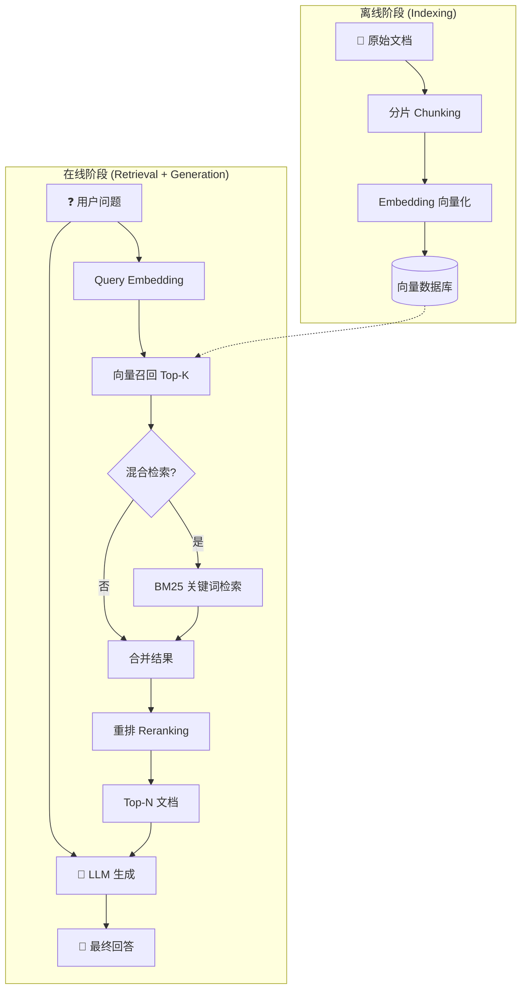

# RAG（Retrieval-Augmented Generation）流程

## 整体架构

RAG 分为两个主要阶段：
- **离线阶段（Indexing）**：准备知识库
- **在线阶段（Retrieval + Generation）**：检索并生成回答

---

## 一、离线阶段：索引构建

### 1. 文档分片（Chunking）
- 将长文档切分成适当大小的片段
- 常见策略：固定长度、按段落、按语义边界
- 注意保留上下文，可设置重叠（overlap）

### 2. 向量化（Embedding）
- 使用 Embedding 模型将文本片段转为向量
- 常用模型：OpenAI text-embedding、BGE、M3E 等

### 3. 存储索引
- 向量存入向量数据库（Milvus、Pinecone、Chroma、FAISS 等）
- 可同时存储原文用于后续生成

---

## 二、在线阶段：检索与生成

### 1. Query 处理
- 用户问题同样经过 Embedding 转为向量
- 可选：Query 改写、扩展以提升召回效果

### 2. 召回（Retrieval）
- **向量相似度检索**：ANN 近似最近邻搜索，返回 top-k 候选
  - 优点：成本低、速度快
  - 缺点：准确率相对较低
- **混合检索（Hybrid Search）**：向量检索 + 关键词检索（BM25）结合，效果更好

### 3. 重排（Reranking）
- 使用 Cross-encoder 对召回结果精排
- 输入：Query + 每个候选文档，输出相关性分数
- 特点：准确率高，但计算成本高
- 典型流程：向量召回 100 条 → 重排后取 top 5-10 条

### 4. 生成（Generation）
- 将重排后的文档片段作为上下文，与用户问题一起送入 LLM
- LLM 基于检索到的知识生成最终回答

---

## 流程图示

---

## 关键权衡

| 环节 | 方案 | 成本 | 速度 | 准确率 |
|------|------|------|------|--------|
| 召回 | 向量相似度 | 低 | 快 | 中 |
| 召回 | 混合检索 | 中 | 中 | 较高 |
| 重排 | Cross-encoder | 高 | 慢 | 高 |

---

## 深入学习清单

### 向量与检索
1. **[Embedding 原理](./01-Embedding原理详解.md)** - 文本如何映射到高维向量空间，语义相似性如何体现为向量距离
2. **[ANN（近似最近邻）算法](./02-ANN近似最近邻算法详解.md)** - HNSW、IVF、PQ 等索引结构，理解速度与精度的权衡
3. **[向量相似度度量](./03-向量相似度度量详解.md)** - 余弦相似度、欧氏距离、点积的区别与适用场景

### 传统检索
4. **[BM25 算法](./04-BM25算法详解.md)** - 经典的关键词检索算法，理解 TF-IDF 的改进版本
5. **[倒排索引](./05-倒排索引详解.md)** - 关键词检索的底层数据结构

### 重排模型
6. **[Bi-encoder vs Cross-encoder](./06-Bi-encoder与Cross-encoder详解.md)** - 为什么 Cross-encoder 更准但更慢，架构上的本质区别
7. **[对比学习（Contrastive Learning）](./07-对比学习详解.md)** - Embedding 模型的训练方式

### 分片策略
8. **[Chunking 策略](./08-Chunking分片策略详解.md)** - 固定长度、递归分割、语义分割的优劣，chunk size 和 overlap 如何影响效果

### 进阶优化
9. **[Query 改写/扩展](./09-Query改写与扩展详解.md)** - HyDE、Query Decomposition 等技术
10. **[混合检索融合策略](./10-混合检索与融合策略详解.md)** - RRF（Reciprocal Rank Fusion）等结果合并算法

### 建议学习顺序

**1 → 2 → 6 → 4 → 8**

这条线能让你理解 RAG 最核心的检索链路。

---

## 详细文档索引

| 序号 | 文档 | 主要内容 |
|------|------|----------|
| 01 | [Embedding原理详解](./01-Embedding原理详解.md) | Word2Vec、Sentence-BERT、对比学习训练 |
| 02 | [ANN近似最近邻算法详解](./02-ANN近似最近邻算法详解.md) | HNSW、IVF、PQ、IVF-PQ |
| 03 | [向量相似度度量详解](./03-向量相似度度量详解.md) | 余弦、欧氏、点积的数学关系 |
| 04 | [BM25算法详解](./04-BM25算法详解.md) | TF-IDF、BM25公式推导、实现 |
| 05 | [倒排索引详解](./05-倒排索引详解.md) | 索引结构、压缩、查询处理 |
| 06 | [Bi-encoder与Cross-encoder详解](./06-Bi-encoder与Cross-encoder详解.md) | 架构对比、两阶段检索 |
| 07 | [对比学习详解](./07-对比学习详解.md) | InfoNCE、SimCLR、SimCSE |
| 08 | [Chunking分片策略详解](./08-Chunking分片策略详解.md) | 各种分片方法、参数选择 |
| 09 | [Query改写与扩展详解](./09-Query改写与扩展详解.md) | HyDE、Query分解、Step-back |
| 10 | [混合检索与融合策略详解](./10-混合检索与融合策略详解.md) | RRF、加权融合、学习排序 |
