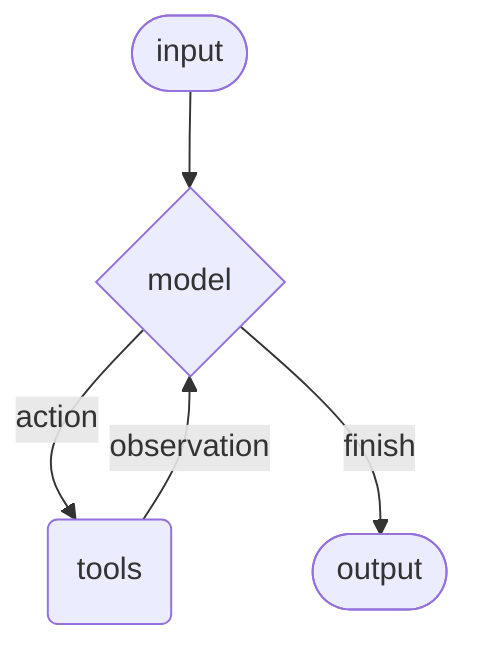

# Agent 详解

Agent 将语言模型与工具结合，创建能够推理任务、决定使用哪些工具、并迭代解决问题的系统。

`create_agent` 提供了一个生产就绪的 Agent 实现，基于 LangGraph 构建图结构的 Agent 运行时。

## 工作原理

Agent 在循环中运行，直到满足停止条件（模型输出最终答案或达到迭代限制）。



### ReAct 模式

ReAct = Reasoning（推理）+ Acting（行动）

核心思路是**循环调用 Action 和 Observation**，让模型根据每次工具返回的结果来调整下一步策略：

- **Action**：模型决定调用哪个工具，以及传什么参数
- **Observation**：工具执行后返回的结果

我的理解是：ReAct的本质是一个Loop
```
Loop {
    模型思考 → Action（调用工具）→ Observation（获取结果）→ 根据结果调整下一步
}
```

模型在每次循环中根据 Observation 来调整策略：
- 信息不够？→ 再调用工具
- 调用错了？→ 换个工具或换个参数  
- 信息够了？→ 输出最终答案

这个循环让模型能够**自我纠正**和**逐步逼近**正确答案，而不是一次性输出。

### ReAct 循环示例

**用户提问**："找到当前最流行的无线耳机并检查库存"

```
================================ Human Message =================================
找到当前最流行的无线耳机并检查库存

================================== AI Message ==================================
Tool Calls:                                    ← Action: 调用搜索工具
  search_products (call_abc123)
  Args: query: wireless headphones

================================= Tool Message =================================
Found 5 products. Top result: WH-1000XM5...    ← Observation: 搜索结果

================================== AI Message ==================================
Tool Calls:                                    ← Action: 根据结果调用库存工具
  check_inventory (call_def456)
  Args: product_id: WH-1000XM5

================================= Tool Message =================================
Product WH-1000XM5: 10 units in stock          ← Observation: 库存结果

================================== AI Message ==================================
找到无线耳机 WH-1000XM5，库存 10 件...           ← Finish: 信息足够，输出答案
```

## 核心组件

### 1. Model

模型是 Agent 的推理引擎，支持静态和动态两种配置方式。

#### 静态模型

静态模型在创建 Agent 时配置一次，在整个执行过程中保持不变。

**方式一：模型标识符字符串**

```python
from langchain.agents import create_agent

agent = create_agent("gpt-4o", tools=tools)
```

模型标识符支持自动推断，例如 `"gpt-4o"` 会被推断为 `"openai:gpt-4o"`。

**方式二：模型实例**

当需要设置 `temperature`、`max_tokens`、`timeout`、`base_url` 等参数时，使用模型实例：

```python
from langchain_openai import ChatOpenAI

model = ChatOpenAI(
    model="gpt-4o",
    temperature=0.1,
    max_tokens=1000,
    timeout=30
)
agent = create_agent(model, tools=tools)
```

#### 动态模型

动态模型在运行时基于当前状态和上下文进行选择，适用于复杂的路由逻辑和成本优化场景。

使用 `@wrap_model_call` 装饰器创建中间件：

```python
from langchain_openai import ChatOpenAI
from langchain.agents import create_agent
from langchain.agents.middleware import wrap_model_call, ModelRequest, ModelResponse

basic_model = ChatOpenAI(model="gpt-4o-mini")
advanced_model = ChatOpenAI(model="gpt-4o")

@wrap_model_call
def dynamic_model_selection(request: ModelRequest, handler) -> ModelResponse:
    """根据对话复杂度选择模型"""
    message_count = len(request.state["messages"])
    if message_count > 10:
        model = advanced_model
    else:
        model = basic_model
    return handler(request.override(model=model))

agent = create_agent(
    model=basic_model,
    tools=tools,
    middleware=[dynamic_model_selection]
)
```

> ⚠️ 当使用结构化输出时，不支持预绑定模型（已调用 `bind_tools` 的模型）。

### 2. Tools

工具赋予 Agent 执行动作的能力。相比简单的模型工具绑定，Agent 提供了：

- 多个工具按顺序调用（由单个提示触发）
- 适当时并行调用工具
- 基于先前结果的动态工具选择
- 工具重试逻辑和错误处理
- 跨工具调用的状态持久化

#### 定义工具

工具可以是普通 Python 函数或协程，使用 `@tool` 装饰器自定义名称、描述和参数模式：

```python
from langchain.tools import tool
from langchain.agents import create_agent

@tool
def search(query: str) -> str:
    """搜索信息"""
    return f"搜索结果: {query}"

@tool
def get_weather(location: str) -> str:
    """获取指定位置的天气信息"""
    return f"{location}的天气: 晴天, 25°C"

agent = create_agent(model, tools=[search, get_weather])
```

如果提供空的工具列表，Agent 将只包含一个没有工具调用能力的 LLM 节点。

#### 工具错误处理

使用 `@wrap_tool_call` 装饰器自定义错误处理：

```python
from langchain.agents import create_agent
from langchain.agents.middleware import wrap_tool_call
from langchain.messages import ToolMessage

@wrap_tool_call
def handle_tool_errors(request, handler):
    """自定义工具错误处理"""
    try:
        return handler(request)
    except Exception as e:
        return ToolMessage(
            content=f"工具错误: 请检查输入后重试。({str(e)})",
            tool_call_id=request.tool_call["id"]
        )

agent = create_agent(
    model="gpt-4o",
    tools=[search, get_weather],
    middleware=[handle_tool_errors]
)
```

### 3. System Prompt

系统提示词用于塑造 Agent 处理任务的方式。

#### 字符串形式

```python
agent = create_agent(
    model,
    tools,
    system_prompt="你是一个有帮助的助手。请简洁准确地回答。"
)
```

当没有提供 `system_prompt` 时，Agent 将直接从消息中推断其任务。

#### SystemMessage 形式

使用 `SystemMessage` 可以更好地控制提示词结构，支持提供商特定功能（如 Anthropic 的提示词缓存）：

```python
from langchain.agents import create_agent
from langchain.messages import SystemMessage, HumanMessage

agent = create_agent(
    model="anthropic:claude-sonnet-4-5",
    system_prompt=SystemMessage(content=[
        {
            "type": "text",
            "text": "你是一个负责分析文学作品的 AI 助手。",
        },
        {
            "type": "text",
            "text": "<大量参考文本内容>",
            "cache_control": {"type": "ephemeral"}
        }
    ])
)
```

`cache_control` 设置为 `{"type": "ephemeral"}` 可让 Anthropic 缓存该内容块，减少重复请求的延迟和成本。

#### 动态系统提示词

使用 `@dynamic_prompt` 装饰器根据运行时上下文生成系统提示词：

```python
from typing import TypedDict
from langchain.agents import create_agent
from langchain.agents.middleware import dynamic_prompt, ModelRequest

class Context(TypedDict):
    user_role: str

@dynamic_prompt
def user_role_prompt(request: ModelRequest) -> str:
    """根据用户角色生成系统提示词"""
    user_role = request.runtime.context.get("user_role", "user")
    base_prompt = "你是一个有帮助的助手。"
    
    if user_role == "expert":
        return f"{base_prompt} 提供详细的技术回答。"
    elif user_role == "beginner":
        return f"{base_prompt} 用简单的语言解释概念，避免术语。"
    return base_prompt

agent = create_agent(
    model="gpt-4o",
    tools=[web_search],
    middleware=[user_role_prompt],
    context_schema=Context
)

result = agent.invoke(
    {"messages": [{"role": "user", "content": "解释机器学习"}]},
    context={"user_role": "expert"}
)
```

## 调用方式

### invoke

```python
result = agent.invoke({
    "messages": [{"role": "user", "content": "旧金山的天气怎么样？"}]
})
```

### stream

如果 Agent 执行多个步骤，`invoke` 可能需要较长时间。使用 `stream` 可以在消息发生时实时输出，显示中间进度。

#### stream_mode="values"

返回每个步骤的完整状态：

```python
for chunk in agent.stream(
    {"messages": [{"role": "user", "content": "搜索 AI 新闻并总结"}]},
    stream_mode="values"
):
    latest_message = chunk["messages"][-1]
    if latest_message.content:
        print(f"Agent: {latest_message.content}")
    elif latest_message.tool_calls:
        print(f"调用工具: {[tc['name'] for tc in latest_message.tool_calls]}")
```

#### stream_mode="updates"

只返回每个步骤的增量更新，而不是完整状态：

```python
for chunk in agent.stream(
    {"messages": [{"role": "user", "content": "搜索 AI 新闻"}]},
    stream_mode="updates"
):
    print(chunk)
```

#### stream_mode="messages"

流式输出消息的 token，适合实时显示 LLM 生成的文本：

```python
for message, metadata in agent.stream(
    {"messages": [{"role": "user", "content": "写一首诗"}]},
    stream_mode="messages"
):
    if message.content:
        print(message.content, end="", flush=True)
```

#### 异步流式输出

```python
async for chunk in agent.astream(
    {"messages": [{"role": "user", "content": "搜索 AI 新闻"}]},
    stream_mode="values"
):
    print(chunk["messages"][-1])
```

#### 组合多种 stream_mode

可以同时使用多种模式：

```python
for chunk in agent.stream(
    {"messages": [{"role": "user", "content": "搜索 AI 新闻"}]},
    stream_mode=["values", "updates"]
):
    print(chunk)
```

Agent 遵循 LangGraph 的 Graph API，支持所有相关方法。

## 高级功能

### 结构化输出

通过 `response_format` 参数让 Agent 以特定格式返回输出。

#### ToolStrategy

使用工具调用生成结构化输出，适用于任何支持工具调用的模型：

```python
from pydantic import BaseModel
from langchain.agents import create_agent
from langchain.agents.structured_output import ToolStrategy

class ContactInfo(BaseModel):
    name: str
    email: str
    phone: str

agent = create_agent(
    model="gpt-4o-mini",
    tools=[search_tool],
    response_format=ToolStrategy(ContactInfo)
)

result = agent.invoke({
    "messages": [{"role": "user", "content": "提取联系信息: 张三, zhang@example.com, 13800138000"}]
})
result["structured_response"]
# ContactInfo(name='张三', email='zhang@example.com', phone='13800138000')
```

#### ProviderStrategy

使用模型提供商的原生结构化输出，更可靠但仅适用于支持该功能的提供商（如 OpenAI）：

```python
from langchain.agents.structured_output import ProviderStrategy

agent = create_agent(
    model="gpt-4o",
    response_format=ProviderStrategy(ContactInfo)
)
```

> ⚠️ 从 LangChain 1.0 开始，不再支持直接传递 schema（如 `response_format=ContactInfo`），必须显式使用 `ToolStrategy` 或 `ProviderStrategy`。

### Memory（状态管理）

Agent 通过消息状态自动维护对话历史，也可以配置自定义状态 schema 来记住额外信息。

#### 为什么需要自定义状态？

默认情况下，Agent 的状态只包含 `messages`（对话历史）。但在实际应用中，你可能需要让 Agent 记住一些额外的信息：

- 用户偏好设置（回答风格、语言等）
- 当前任务的进度或上下文
- 跨多轮对话的累计数据
- 工具需要访问的全局配置

这些信息存储在状态中，可以被视为 Agent 的**短期记忆**。

#### 基本用法

自定义状态 schema 必须作为 `TypedDict` 扩展 `AgentState`：

```python
from langchain.agents import AgentState, create_agent

class CustomState(AgentState):
    user_preferences: dict  # 新增字段：用户偏好

agent = create_agent(
    model="gpt-4o",
    tools=[...],
    state_schema=CustomState
)

# 调用时传入额外的状态
result = agent.invoke({
    "messages": [{"role": "user", "content": "解释什么是 API"}],
    "user_preferences": {"style": "简洁", "language": "中文"}
})
```

#### 在工具中访问状态

自定义状态可以在工具中通过 `InjectedState` 访问：

```python
from langchain.tools import tool, InjectedState
from typing import Annotated

@tool
def personalized_search(
    query: str,
    state: Annotated[dict, InjectedState]
) -> str:
    """根据用户偏好进行个性化搜索"""
    prefs = state.get("user_preferences", {})
    language = prefs.get("language", "en")
    # 根据用户偏好调整搜索逻辑
    return f"搜索结果 ({language}): {query}"
```

#### 通过中间件定义状态（推荐）

当需要在模型调用前后访问或修改状态时，使用中间件方式：

```python
from langchain.agents import AgentState
from langchain.agents.middleware import AgentMiddleware
from typing import Any

class CustomState(AgentState):
    user_preferences: dict
    request_count: int  # 记录请求次数

class CustomMiddleware(AgentMiddleware):
    state_schema = CustomState
    tools = [tool1, tool2]
    
    def before_model(self, state: CustomState, runtime) -> dict[str, Any] | None:
        # 在模型调用前，可以根据状态做一些处理
        prefs = state.get("user_preferences", {})
        if prefs.get("style") == "简洁":
            # 可以在这里修改消息、注入提示等
            pass
        
        # 更新请求计数
        return {"request_count": state.get("request_count", 0) + 1}

agent = create_agent(
    model,
    tools=tools,
    middleware=[CustomMiddleware()]
)

result = agent.invoke({
    "messages": [{"role": "user", "content": "我喜欢技术性的解释"}],
    "user_preferences": {"style": "technical", "verbosity": "detailed"},
    "request_count": 0
})
```

#### 通过 state_schema 定义状态

如果只需要在工具中访问状态，可以使用更简单的方式：

```python
from langchain.agents import AgentState

class CustomState(AgentState):
    user_preferences: dict

agent = create_agent(
    model,
    tools=[tool1, tool2],
    state_schema=CustomState
)
```

#### 两种方式的对比

| 方式 | 适用场景 | 优势 |
|------|----------|------|
| `state_schema` 参数 | 只需要在工具中访问状态 | 简单直接 |
| 中间件方式 | 需要在模型调用前后处理状态 | 更灵活，可以修改状态 |

通过中间件定义状态的优势在于可以将状态扩展限定在相关的中间件和工具范围内。

#### 什么时候需要自定义状态？

大多数简单场景不需要自定义状态，默认的 `messages` 就够了。

需要使用的场景：
- 多轮对话中需要记住用户设置
- 工具需要访问一些全局信息
- 需要在中间件中根据状态做判断
- 需要跟踪任务进度或统计数据

> ⚠️ 从 LangChain 1.0 开始，自定义状态 schema 必须是 `TypedDict` 类型，不再支持 Pydantic 模型和 dataclass。

## Middleware

中间件为自定义 Agent 行为提供了强大的扩展能力：

- 在模型调用前处理状态（消息裁剪、上下文注入）
- 修改或验证模型的响应（护栏、内容过滤）
- 自定义工具执行错误处理
- 基于状态或上下文实现动态模型选择
- 添加自定义日志、监控或分析

主要装饰器：

| 装饰器 | 作用 |
|--------|------|
| `@before_model` | 模型调用前处理 |
| `@after_model` | 模型响应后处理 |
| `@wrap_model_call` | 包装模型调用 |
| `@wrap_tool_call` | 包装工具调用 |
| `@dynamic_prompt` | 动态生成系统提示词 |

## 注意事项

1. 自定义状态必须是 `TypedDict` 类型，不再支持 Pydantic 模型
2. 结构化输出必须显式使用 `ToolStrategy` 或 `ProviderStrategy`
3. 动态模型选择时，不要使用预绑定工具的模型（`bind_tools`）
