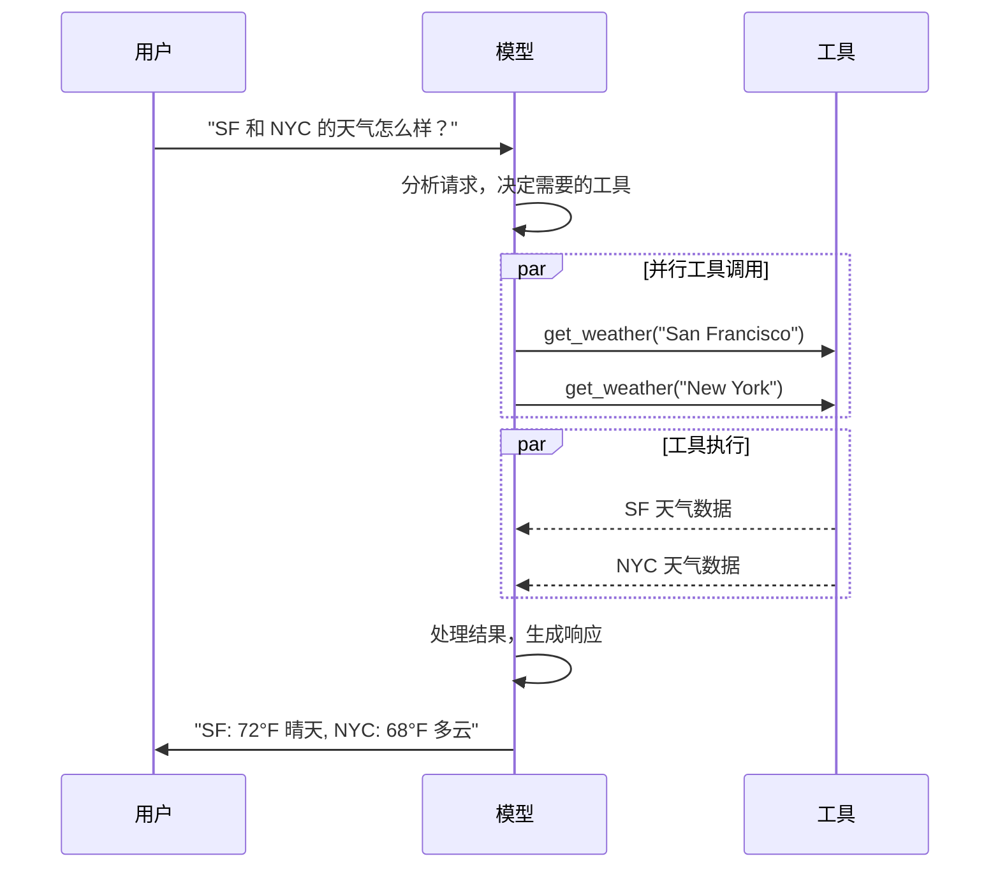

# Models 详解

LLM（大语言模型）是强大的 AI 工具，能够像人类一样理解和生成文本。它们可以编写内容、翻译语言、总结和回答问题，而无需为每个任务进行专门训练。

除了文本生成，许多模型还支持：

-  **Tool calling** - 调用外部工具（如数据库查询或 API 调用）并在响应中使用结果
-  **Structured output** - 模型的响应被约束为遵循定义的格式
-  **Multimodality** - 处理和返回文本以外的数据，如图像、音频和视频
-  **Reasoning** - 模型执行多步推理以得出结论

模型是 Agent 的推理引擎，驱动 Agent 的决策过程，决定调用哪些工具、如何解释结果以及何时提供最终答案。

## 基本用法

模型可以通过两种方式使用：

1. **与 Agent 一起** - 在创建 Agent 时动态指定模型
2. **独立使用** - 直接调用模型进行文本生成、分类或提取等任务

### 初始化模型

使用 `init_chat_model` 从聊天模型提供商初始化模型：

```python
from langchain.chat_models import init_chat_model

# OpenAI
model = init_chat_model("gpt-4o")

# Anthropic
model = init_chat_model("claude-sonnet-4-5-20250929")

# Google Gemini
model = init_chat_model("google_genai:gemini-2.5-flash-lite")

# Azure OpenAI
model = init_chat_model(
    "azure_openai:gpt-4.1",
    azure_deployment=os.environ["AZURE_OPENAI_DEPLOYMENT_NAME"],
)
```

模型标识符支持自动推断，也可以使用 `{provider}:{model}` 格式明确指定。

### 直接使用模型类

```python
from langchain_openai import ChatOpenAI

model = ChatOpenAI(model="gpt-4o")
response = model.invoke("为什么鹦鹉会说话？")
```

## 核心参数

| 参数 | 类型 | 说明 |
|------|------|------|
| `model` | string | 模型名称或标识符 |
| `api_key` | string | API 密钥 |
| `temperature` | number | 控制输出随机性，越高越有创意，越低越确定 |
| `max_tokens` | number | 限制响应的最大 token 数 |
| `timeout` | number | 请求超时时间（秒） |
| `max_retries` | number | 失败时的最大重试次数 |

```python
model = init_chat_model(
    "claude-sonnet-4-5-20250929",
    temperature=0.7,
    timeout=30,
    max_tokens=1000,
)
```

## 调用方式

### invoke - 同步调用

```python
# 单条消息
response = model.invoke("为什么鹦鹉有彩色羽毛？")

# 对话历史（字典格式）
conversation = [
    {"role": "system", "content": "你是一个将英语翻译成法语的助手。"},
    {"role": "user", "content": "翻译：I love programming."},
    {"role": "assistant", "content": "J'adore la programmation."},
    {"role": "user", "content": "翻译：I love building applications."}
]
response = model.invoke(conversation)

# 对话历史（Message 对象）
from langchain.messages import HumanMessage, AIMessage, SystemMessage

conversation = [
    SystemMessage("你是一个将英语翻译成法语的助手。"),
    HumanMessage("翻译：I love programming."),
    AIMessage("J'adore la programmation."),
    HumanMessage("翻译：I love building applications.")
]
response = model.invoke(conversation)
```

### stream - 流式输出

流式输出可以在生成过程中逐步显示内容，提升用户体验：

```python
# 基本文本流式输出
for chunk in model.stream("为什么鹦鹉有彩色羽毛？"):
    print(chunk.text, end="|", flush=True)

# 流式输出工具调用、推理等内容
for chunk in model.stream("天空是什么颜色？"):
    for block in chunk.content_blocks:
        if block["type"] == "reasoning" and (reasoning := block.get("reasoning")):
            print(f"推理: {reasoning}")
        elif block["type"] == "tool_call_chunk":
            print(f"工具调用: {block}")
        elif block["type"] == "text":
            print(block["text"])
```

#### 累积 chunks 构建完整消息

```python
full = None
for chunk in model.stream("天空是什么颜色？"):
    full = chunk if full is None else full + chunk

print(full.text)
print(full.content_blocks)
```

### batch - 批量调用

批量处理多个独立请求可以显著提高性能：

```python
responses = model.batch([
    "为什么鹦鹉有彩色羽毛？",
    "飞机是如何飞行的？",
    "什么是量子计算？"
])

for response in responses:
    print(response)
```

#### 控制并发数

```python
model.batch(
    list_of_inputs,
    config={'max_concurrency': 5}  # 限制为 5 个并行调用
)
```

#### 按完成顺序返回

```python
for response in model.batch_as_completed([
    "问题1",
    "问题2",
    "问题3"
]):
    print(response)  # 结果可能乱序，每个包含输入索引
```

## Tool Calling（工具调用）

模型可以请求调用执行任务的工具，如从数据库获取数据、搜索网络或运行代码。

### 基本流程



### 绑定工具

```python
from langchain.tools import tool

@tool
def get_weather(location: str) -> str:
    """获取指定位置的天气"""
    return f"{location}天气晴朗。"

model_with_tools = model.bind_tools([get_weather])

response = model_with_tools.invoke("波士顿的天气怎么样？")
for tool_call in response.tool_calls:
    print(f"工具: {tool_call['name']}")
    print(f"参数: {tool_call['args']}")
```

### 工具执行循环

当模型返回工具调用时，需要执行工具并将结果传回模型：

```python
model_with_tools = model.bind_tools([get_weather])

# 步骤 1：模型生成工具调用
messages = [{"role": "user", "content": "波士顿的天气怎么样？"}]
ai_msg = model_with_tools.invoke(messages)
messages.append(ai_msg)

# 步骤 2：执行工具并收集结果
for tool_call in ai_msg.tool_calls:
    tool_result = get_weather.invoke(tool_call)
    messages.append(tool_result)

# 步骤 3：将结果传回模型获取最终响应
final_response = model_with_tools.invoke(messages)
print(final_response.text)
```

### 强制使用工具

默认情况下，模型自己决定是否调用工具。可以通过 `tool_choice` 强制模型调用工具。

```python
from langchain.tools import tool

@tool
def search_web(query: str) -> str:
    """在网上搜索信息"""
    return f"搜索结果: {query}"

@tool
def get_weather(location: str) -> str:
    """获取天气信息"""
    return f"{location}: 晴天 25°C"

@tool
def calculate(expression: str) -> str:
    """计算数学表达式"""
    return str(eval(expression))

# 默认：模型自己决定用不用工具，用哪个
model_with_tools = model.bind_tools([search_web, get_weather, calculate])

# 强制使用任意工具（必须调用至少一个，但选哪个由模型决定）
model_with_tools = model.bind_tools(
    [search_web, get_weather, calculate],
    tool_choice="any"
)

# 强制使用特定工具（必须调用 get_weather）
model_with_tools = model.bind_tools(
    [search_web, get_weather, calculate],
    tool_choice="get_weather"
)
```

| tool_choice | 行为 |
|-------------|------|
| 不设置 | 模型自己决定是否调用工具，调用哪个 |
| `"any"` | 必须调用至少一个工具，但选哪个由模型决定 |
| `"get_weather"` | 必须调用指定的工具 |

### 并行工具调用

当用户的问题涉及多个独立的信息时，模型可以一次性返回多个工具调用请求，而不是分多次返回。

```python
from langchain.tools import tool

@tool
def get_weather(location: str) -> str:
    """获取天气信息"""
    return f"{location}: 晴天 25°C"

@tool
def get_population(city: str) -> str:
    """获取城市人口"""
    return f"{city}: 1000万人"

model_with_tools = model.bind_tools([get_weather, get_population])

# 用户问多个城市的天气
response = model_with_tools.invoke("北京、上海、广州的天气怎么样？")
print(response.tool_calls)
# [
#   {'name': 'get_weather', 'args': {'location': '北京'}, 'id': 'call_1'},
#   {'name': 'get_weather', 'args': {'location': '上海'}, 'id': 'call_2'},
#   {'name': 'get_weather', 'args': {'location': '广州'}, 'id': 'call_3'},
# ]

# 用户问不同类型的信息
response = model_with_tools.invoke("北京的天气和人口分别是多少？")
print(response.tool_calls)
# [
#   {'name': 'get_weather', 'args': {'location': '北京'}, 'id': 'call_1'},
#   {'name': 'get_population', 'args': {'city': '北京'}, 'id': 'call_2'},
# ]
```

模型一次 invoke 返回多个工具调用，这些调用是独立的，可以并行执行。

禁用并行工具调用：

```python
model.bind_tools([get_weather, get_population], parallel_tool_calls=False)
```

## Structured Output（结构化输出）

可以请求模型以匹配给定 schema 的格式提供响应，而不是返回自由格式的文本。这对于确保输出可以被程序解析和使用非常有用。

LangChain 支持三种定义 schema 的方式：

### 使用 Pydantic

Pydantic 是 Python 的数据验证库，提供最丰富的功能：字段验证、描述和嵌套结构。

```python
from pydantic import BaseModel, Field

class Movie(BaseModel):
    """电影详情"""
    title: str = Field(..., description="电影标题")
    year: int = Field(..., description="上映年份")
    director: str = Field(..., description="导演")
    rating: float = Field(..., description="评分（满分10分）")

model_with_structure = model.with_structured_output(Movie)
response = model_with_structure.invoke("提供电影《盗梦空间》的详情")
print(response)  # Movie(title="Inception", year=2010, director="Christopher Nolan", rating=8.8)
print(response.title)  # "Inception" - 可以直接访问属性
```

返回的是 Pydantic 对象，有类型提示和自动验证。

### 使用 TypedDict

TypedDict 是 Python 内置的类型提示，比 Pydantic 更轻量，适合不需要运行时验证的场景。

```python
from typing_extensions import TypedDict, Annotated

class MovieDict(TypedDict):
    """电影详情"""
    title: Annotated[str, ..., "电影标题"]
    year: Annotated[int, ..., "上映年份"]
    director: Annotated[str, ..., "导演"]
    rating: Annotated[float, ..., "评分"]

model_with_structure = model.with_structured_output(MovieDict)
response = model_with_structure.invoke("提供电影《盗梦空间》的详情")
print(response)  # {'title': 'Inception', 'year': 2010, ...}
print(response["title"])  # "Inception" - 用字典方式访问
```

返回的是普通字典，没有运行时验证。

### 三种方式对比

| 方式 | 返回类型 | 运行时验证 | 适用场景 |
|------|----------|------------|----------|
| Pydantic | 对象 | ✅ 有 | 需要验证、复杂嵌套结构 |
| TypedDict | 字典 | ❌ 无 | 简单场景、轻量级 |
| JSON Schema | 字典 | ❌ 无 | 跨语言、最大控制 |

### 使用 JSON Schema

直接提供原始 JSON Schema，适合需要最大控制或跨语言互操作的场景。

```python
json_schema = {
    "title": "Movie",
    "type": "object",
    "properties": {
        "title": {"type": "string", "description": "电影标题"},
        "year": {"type": "integer", "description": "上映年份"},
        "director": {"type": "string", "description": "导演"},
        "rating": {"type": "number", "description": "评分"}
    },
    "required": ["title", "year", "director", "rating"]
}

model_with_structure = model.with_structured_output(json_schema, method="json_schema")
```

### 获取原始消息和解析结果

如果需要同时访问原始 AIMessage（比如获取 token 使用量），可以设置 `include_raw=True`：

```python
model_with_structure = model.with_structured_output(Movie, include_raw=True)
response = model_with_structure.invoke("提供电影《盗梦空间》的详情")
# {
#     "raw": AIMessage(...),           # 原始消息，包含 usage_metadata 等
#     "parsed": Movie(title=..., ...),  # 解析后的结构化对象
#     "parsing_error": None,            # 解析错误（如果有）
# }
```

## Multimodal（多模态）

某些模型可以处理和返回非文本数据，如图像、音频和视频。

```python
# 多模态输出
response = model.invoke("创建一张猫的图片")
print(response.content_blocks)
# [
#     {"type": "text", "text": "这是一张猫的图片"},
#     {"type": "image", "base64": "...", "mime_type": "image/jpeg"},
# ]
```

## Reasoning（推理）

许多模型能够执行多步推理以得出结论。

```python
# 流式输出推理过程
for chunk in model.stream("为什么鹦鹉有彩色羽毛？"):
    reasoning_steps = [r for r in chunk.content_blocks if r["type"] == "reasoning"]
    print(reasoning_steps if reasoning_steps else chunk.text)

# 完整推理输出
response = model.invoke("为什么鹦鹉有彩色羽毛？")
reasoning_steps = [b for b in response.content_blocks if b["type"] == "reasoning"]
print(" ".join(step["reasoning"] for step in reasoning_steps))
```

## 高级功能

### Prompt Caching（提示词缓存）

许多提供商提供提示词缓存功能以减少延迟和成本：

- **隐式缓存**：提供商自动缓存（OpenAI、Gemini）
- **显式缓存**：手动指定缓存点（Anthropic）

缓存使用情况会反映在响应的 usage metadata 中。

### Rate Limiting（速率限制）

```python
from langchain_core.rate_limiters import InMemoryRateLimiter

rate_limiter = InMemoryRateLimiter(
    requests_per_second=0.1,      # 每 10 秒 1 个请求
    check_every_n_seconds=0.1,    # 每 100ms 检查一次
    max_bucket_size=10,           # 最大突发大小
)

model = init_chat_model(
    model="gpt-4o",
    rate_limiter=rate_limiter
)
```

### Token Usage（Token 使用量）

```python
from langchain_core.callbacks import get_usage_metadata_callback

with get_usage_metadata_callback() as cb:
    model.invoke("Hello")
    print(cb.usage_metadata)
# {
#   'gpt-4o-mini-2024-07-18': {
#     'input_tokens': 8,
#     'output_tokens': 10,
#     'total_tokens': 18,
#     ...
#   }
# }
```

### Base URL / Proxy

```python
# 使用 OpenAI 兼容的 API
model = init_chat_model(
    model="MODEL_NAME",
    model_provider="openai",
    base_url="BASE_URL",
    api_key="YOUR_API_KEY",
)

# 使用代理
from langchain_openai import ChatOpenAI

model = ChatOpenAI(
    model="gpt-4o",
    openai_proxy="http://proxy.example.com:8080"
)
```

### Configurable Models（可配置模型）

创建运行时可配置的模型：

```python
configurable_model = init_chat_model(temperature=0)

# 使用 GPT
configurable_model.invoke(
    "你叫什么名字",
    config={"configurable": {"model": "gpt-4o-mini"}},
)

# 使用 Claude
configurable_model.invoke(
    "你叫什么名字",
    config={"configurable": {"model": "claude-sonnet-4-5-20250929"}},
)
```

## 主要提供商

| 提供商 | 安装 | 模型示例 |
|--------|------|----------|
| OpenAI | `pip install langchain[openai]` | gpt-4o, gpt-4o-mini |
| Anthropic | `pip install langchain[anthropic]` | claude-sonnet-4-5 |
| Google | `pip install langchain[google-genai]` | gemini-2.5-flash |
| Azure | `pip install langchain[openai]` | gpt-4.1 |
| AWS Bedrock | `pip install langchain[aws]` | claude-3-5-sonnet |
| HuggingFace | `pip install langchain[huggingface]` | Phi-3-mini |

## 本地模型

LangChain 支持在本地硬件上运行模型，适用于数据隐私要求高或需要避免云服务成本的场景。

[Ollama](https://ollama.ai/) 是运行本地模型最简单的方式之一。
