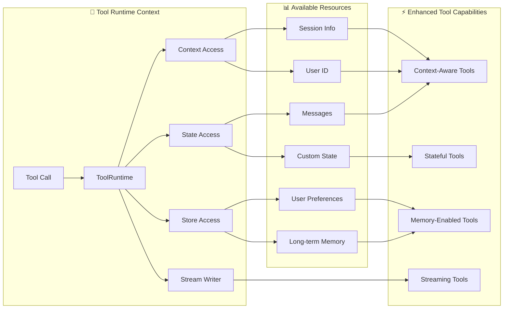

# Tools 详解

Tools 扩展了 Agent 的能力——让它们能够获取实时数据、执行代码、查询外部数据库，以及在现实世界中执行操作。

本质上，Tools 是具有明确定义的输入和输出的可调用函数，它们被传递给聊天模型。模型根据对话上下文决定何时调用工具，以及提供什么输入参数。

## 创建工具

### 基本工具定义

使用 `@tool` 装饰器是创建工具最简单的方式。默认情况下，函数的 docstring 会成为工具的描述，帮助模型理解何时使用它：

```python
from langchain.tools import tool

@tool
def search_database(query: str, limit: int = 10) -> str:
    """搜索客户数据库中匹配查询的记录。
    
    Args:
        query: 要查找的搜索词
        limit: 返回结果的最大数量
    """
    return f"找到 {limit} 条关于 '{query}' 的结果"
```

**类型提示是必需的**，因为它们定义了工具的输入 schema。docstring 应该信息丰富且简洁，帮助模型理解工具的用途。

### 自定义工具属性

#### 自定义工具名称

默认情况下，工具名称来自函数名。当需要更具描述性的名称时可以覆盖它：

```python
@tool("web_search")  # 自定义名称
def search(query: str) -> str:
    """在网上搜索信息。"""
    return f"搜索结果: {query}"

print(search.name)  # web_search
```

#### 自定义工具描述

覆盖自动生成的工具描述，为模型提供更清晰的指导：

```python
@tool("calculator", description="执行算术计算。用于任何数学问题。")
def calc(expression: str) -> str:
    """计算数学表达式。"""
    return str(eval(expression))
```

### 高级 Schema 定义

使用 Pydantic 模型或 JSON Schema 定义复杂输入：

#### 使用 Pydantic

```python
from pydantic import BaseModel, Field
from typing import Literal

class WeatherInput(BaseModel):
    """天气查询的输入。"""
    location: str = Field(description="城市名称或坐标")
    units: Literal["celsius", "fahrenheit"] = Field(
        default="celsius",
        description="温度单位偏好"
    )
    include_forecast: bool = Field(
        default=False,
        description="是否包含 5 天预报"
    )

@tool(args_schema=WeatherInput)
def get_weather(
    location: str, 
    units: str = "celsius", 
    include_forecast: bool = False
) -> str:
    """获取当前天气和可选的预报。"""
    temp = 22 if units == "celsius" else 72
    result = f"{location} 当前天气: {temp} 度 ({units})"
    if include_forecast:
        result += "\n未来 5 天: 晴天"
    return result
```

#### 使用 JSON Schema

```python
weather_schema = {
    "type": "object",
    "properties": {
        "location": {"type": "string", "description": "城市名称"},
        "units": {"type": "string", "description": "温度单位"},
        "include_forecast": {"type": "boolean", "description": "是否包含预报"}
    },
    "required": ["location"]
}

@tool(args_schema=weather_schema)
def get_weather(
    location: str, 
    units: str = "celsius", 
    include_forecast: bool = False
) -> str:
    """获取当前天气和可选的预报。"""
    temp = 22 if units == "celsius" else 72
    return f"{location} 当前天气: {temp} 度"
```

### 保留参数名称

以下参数名称是保留的，不能用作工具参数：

| 参数名 | 用途 |
|--------|------|
| `config` | 保留用于内部传递 `RunnableConfig` |
| `runtime` | 保留用于 `ToolRuntime` 参数（访问状态、上下文、存储） |

## 访问上下文

工具最强大的地方在于它们可以访问 Agent 状态、运行时上下文和长期记忆。这使工具能够做出上下文感知的决策、个性化响应，并在对话之间维护信息。

运行时上下文提供了一种在运行时将依赖项（如数据库连接、用户 ID 或配置）注入到工具中的方法，使工具更易于测试和重用。

### ToolRuntime

使用 `ToolRuntime` 在单个参数中访问所有运行时信息。只需在工具签名中添加 `runtime: ToolRuntime`，它会自动注入而不会暴露给 LLM。



```python
from langchain.tools import tool, ToolRuntime
```

`ToolRuntime` 提供：

| 属性 | 说明 |
|------|------|
| `runtime.state` | **状态** - 执行过程中流动的可变数据（如消息、计数器、自定义字段） |
| `runtime.context` | **上下文** - 不可变配置，如用户 ID、会话详情或应用特定配置 |
| `runtime.store` | **存储** - 跨对话的持久化长期记忆 |
| `runtime.stream_writer` | **流写入器** - 工具执行时流式发送自定义更新 |
| `runtime.config` | **配置** - 执行的 `RunnableConfig`，包含回调、标签等运行时配置 |
| `runtime.tool_call_id` | **工具调用 ID** - 当前工具调用的唯一标识符，用于关联 ToolMessage |

### 访问状态

工具可以使用 `ToolRuntime` 访问当前图状态：

```python
from langchain.tools import tool, ToolRuntime

@tool
def summarize_conversation(runtime: ToolRuntime) -> str:
    """总结到目前为止的对话。"""
    messages = runtime.state["messages"]
    human_msgs = sum(1 for m in messages if m.__class__.__name__ == "HumanMessage")
    ai_msgs = sum(1 for m in messages if m.__class__.__name__ == "AIMessage")
    tool_msgs = sum(1 for m in messages if m.__class__.__name__ == "ToolMessage")
    return f"对话包含 {human_msgs} 条用户消息，{ai_msgs} 条 AI 回复，{tool_msgs} 条工具结果"

@tool
def get_user_preference(
    pref_name: str,
    runtime: ToolRuntime  # ToolRuntime 参数对模型不可见
) -> str:
    """获取用户偏好值。"""
    preferences = runtime.state.get("user_preferences", {})
    return preferences.get(pref_name, "未设置")
```

> ⚠️ `runtime` 参数对模型是隐藏的。上面的例子中，模型只能看到 `pref_name`，`runtime` 不会包含在请求中。

### 更新状态

使用 `Command` 更新 Agent 的状态或控制图的执行流程：

```python
from langgraph.types import Command
from langchain.messages import RemoveMessage
from langgraph.graph.message import REMOVE_ALL_MESSAGES
from langchain.tools import tool, ToolRuntime

# 通过删除所有消息来更新对话历史
@tool
def clear_conversation() -> Command:
    """清除对话历史。"""
    return Command(
        update={
            "messages": [RemoveMessage(id=REMOVE_ALL_MESSAGES)],
        }
    )

# 更新 Agent 状态中的 user_name
@tool
def update_user_name(new_name: str, runtime: ToolRuntime) -> Command:
    """更新用户名称。"""
    return Command(update={"user_name": new_name})
```

### 访问上下文（Context）

通过 `runtime.context` 访问不可变配置和上下文数据，如用户 ID、会话详情或应用特定配置：

```python
from dataclasses import dataclass
from langchain_openai import ChatOpenAI
from langchain.agents import create_agent
from langchain.tools import tool, ToolRuntime

# 模拟用户数据库
USER_DATABASE = {
    "user123": {
        "name": "张三",
        "account_type": "高级会员",
        "balance": 5000,
        "email": "zhangsan@example.com"
    },
    "user456": {
        "name": "李四",
        "account_type": "普通会员",
        "balance": 1200,
        "email": "lisi@example.com"
    }
}

@dataclass
class UserContext:
    user_id: str

@tool
def get_account_info(runtime: ToolRuntime[UserContext]) -> str:
    """获取当前用户的账户信息。"""
    user_id = runtime.context.user_id
    if user_id in USER_DATABASE:
        user = USER_DATABASE[user_id]
        return f"账户持有人: {user['name']}\n类型: {user['account_type']}\n余额: ¥{user['balance']}"
    return "用户未找到"

model = ChatOpenAI(model="gpt-4o")
agent = create_agent(
    model,
    tools=[get_account_info],
    context_schema=UserContext,
    system_prompt="你是一个金融助手。"
)

# 调用时传入上下文
result = agent.invoke(
    {"messages": [{"role": "user", "content": "我的当前余额是多少？"}]},
    context=UserContext(user_id="user123")
)
```

### 访问长期记忆（Store）

使用 store 访问跨对话的持久化数据。通过 `runtime.store` 访问，允许保存和检索用户特定或应用特定的数据：

```python
from typing import Any
from langgraph.store.memory import InMemoryStore
from langchain.agents import create_agent
from langchain.tools import tool, ToolRuntime

# 读取记忆
@tool
def get_user_info(user_id: str, runtime: ToolRuntime) -> str:
    """查找用户信息。"""
    store = runtime.store
    user_info = store.get(("users",), user_id)
    return str(user_info.value) if user_info else "未知用户"

# 写入记忆
@tool
def save_user_info(
    user_id: str, 
    user_info: dict[str, Any], 
    runtime: ToolRuntime
) -> str:
    """保存用户信息。"""
    store = runtime.store
    store.put(("users",), user_id, user_info)
    return "成功保存用户信息。"

store = InMemoryStore()
agent = create_agent(
    model,
    tools=[get_user_info, save_user_info],
    store=store
)

# 第一次会话：保存用户信息
agent.invoke({
    "messages": [{
        "role": "user", 
        "content": "保存以下用户: userid: abc123, name: 王五, age: 25, email: wangwu@example.com"
    }]
})

# 第二次会话：获取用户信息
agent.invoke({
    "messages": [{
        "role": "user", 
        "content": "获取 id 为 'abc123' 的用户信息"
    }]
})
# 输出：用户 abc123 的信息：姓名：王五，年龄：25，邮箱：wangwu@example.com
```

### 流式更新（Stream Writer）

使用 `runtime.stream_writer` 在工具执行时流式发送自定义更新。这对于向用户提供工具正在做什么的实时反馈很有用：

```python
from langchain.tools import tool, ToolRuntime

@tool
def get_weather(city: str, runtime: ToolRuntime) -> str:
    """获取指定城市的天气。"""
    writer = runtime.stream_writer
    
    # 工具执行时流式发送自定义更新
    writer(f"正在查找城市数据: {city}")
    writer(f"已获取 {city} 的数据")
    
    return f"{city} 总是阳光明媚！"
```

> ⚠️ 如果在工具中使用 `runtime.stream_writer`，工具必须在 LangGraph 执行上下文中调用。

## 工具与模型的关系

```
用户提问 → 模型分析 → 决定调用哪个工具 → 工具执行 → 结果返回模型 → 生成回答
```

模型通过以下信息决定是否调用工具：

1. **工具名称** - 简洁描述工具功能
2. **工具描述** - docstring 或 description 参数
3. **参数 Schema** - 类型提示和 Field 描述

## 最佳实践

### 1. 写好 docstring

docstring 是模型理解工具的关键：

```python
# ❌ 不好的 docstring
@tool
def search(q: str) -> str:
    """搜索。"""
    ...

# ✅ 好的 docstring
@tool
def search_products(query: str, category: str = None) -> str:
    """在产品数据库中搜索商品。
    
    当用户询问产品信息、价格或库存时使用此工具。
    
    Args:
        query: 搜索关键词，如产品名称或描述
        category: 可选的产品类别，如 "电子产品"、"服装"
    """
    ...
```

### 2. 使用类型提示

类型提示帮助模型理解参数类型：

```python
from typing import Literal, Optional

@tool
def book_flight(
    origin: str,
    destination: str,
    date: str,
    class_type: Literal["economy", "business", "first"] = "economy",
    passengers: int = 1
) -> str:
    """预订航班。"""
    ...
```

### 3. 处理错误

工具应该优雅地处理错误：

```python
@tool
def get_stock_price(symbol: str) -> str:
    """获取股票价格。"""
    try:
        # 调用 API
        price = fetch_stock_price(symbol)
        return f"{symbol} 当前价格: ${price}"
    except Exception as e:
        return f"无法获取 {symbol} 的价格: {str(e)}"
```

## 服务器端工具

一些聊天模型（如 OpenAI、Anthropic、Gemini）提供内置工具，在服务器端执行，如网络搜索和代码解释器。这些工具不需要你定义，直接通过模型参数启用。

## 总结

| 概念 | 说明 |
|------|------|
| `@tool` 装饰器 | 将函数转换为 LangChain 工具 |
| docstring | 帮助模型理解何时使用工具 |
| 类型提示 | 定义工具的输入 schema |
| `ToolRuntime` | 访问状态、上下文、存储等运行时信息 |
| `Command` | 更新 Agent 状态 |
| `args_schema` | 使用 Pydantic 或 JSON Schema 定义复杂输入 |
