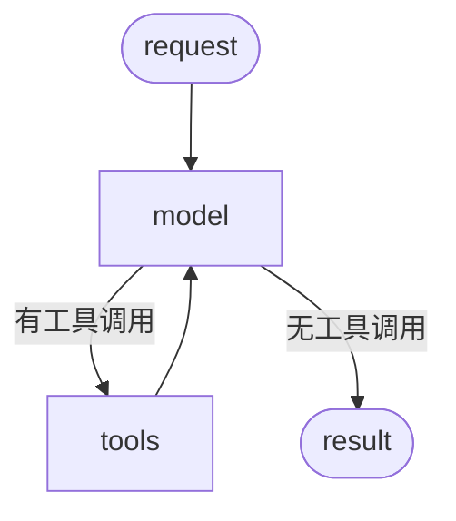
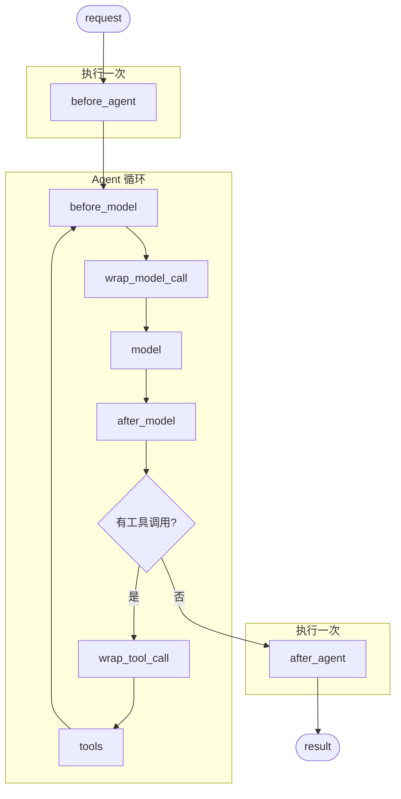

# 中间件详解

中间件（Middleware）提供了一种更精细地控制 Agent 内部行为的方式。

## 中间件能做什么？

| 用途 | 说明 |
|------|------|
| 跟踪行为 | 日志记录、分析、调试 |
| 转换处理 | 提示词转换、工具选择、输出格式化 |
| 控制流程 | 重试、降级、提前终止 |
| 安全防护 | 速率限制、护栏、PII 检测 |

## 基本用法

通过 `middleware` 参数传递给 `create_agent`：

```python
from langchain.agents import create_agent
from langchain.agents.middleware import SummarizationMiddleware, HumanInTheLoopMiddleware

agent = create_agent(
    model="gpt-4o",
    tools=[...],
    middleware=[
        SummarizationMiddleware(...),
        HumanInTheLoopMiddleware(...)
    ],
)
```

## Agent 循环

核心 Agent 循环：调用模型 → 模型选择工具执行 → 不再调用工具时结束



## 中间件钩子

中间件在每个步骤之前和之后都会暴露钩子：



**执行说明：**
- `before_agent` / `after_agent` - 整个 Agent 执行前后，只执行一次
- `before_model` / `after_model` - 在循环内，每次模型调用都会执行
- `wrap_model_call` - 包装模型调用（可实现降级、重试等）
- `wrap_tool_call` - 包装工具调用（可实现错误处理、重试等）

## 主要钩子

| 钩子 | 触发时机 | 用途 |
|------|----------|------|
| `before_agent` | Agent 执行前 | 初始化、预处理 |
| `before_model` | 模型调用前 | 修改消息、裁剪历史、注入上下文 |
| `wrap_model_call` | 包装模型调用 | 动态模型选择、降级、重试 |
| `wrap_tool_call` | 包装工具调用 | 错误处理、重试、权限检查 |
| `after_model` | 模型调用后 | 验证响应、内容过滤、护栏 |
| `after_agent` | Agent 执行后 | 后处理、清理 |

## 内置中间件

LangChain 提供了一些常用的内置中间件：

| 中间件 | 用途 |
|--------|------|
| `SummarizationMiddleware` | 自动总结长对话历史 |
| `HumanInTheLoopMiddleware` | 人工审核工具调用 |
| `ModelCallLimitMiddleware` | 限制模型调用次数 |
| `ToolCallLimitMiddleware` | 限制工具调用次数 |
| `ModelFallbackMiddleware` | 模型降级 |
| `PIIMiddleware` | PII 检测 |
| `TodoListMiddleware` | 任务规划和跟踪 |
| `LLMToolSelectorMiddleware` | 动态工具选择 |
| `ToolRetryMiddleware` | 工具调用重试 |
| `ModelRetryMiddleware` | 模型调用重试 |
| `LLMToolEmulator` | 工具模拟（测试用） |
| `ContextEditingMiddleware` | 上下文编辑 |
| `ShellToolMiddleware` | Shell 命令执行 |
| `FilesystemFileSearchMiddleware` | 文件搜索 |

### SummarizationMiddleware

当对话接近 token 限制时，自动总结对话历史，保留最近的消息同时压缩旧的上下文。

**适用场景：**
- 超出上下文窗口的长对话
- 需要保留完整对话上下文的应用

```python
from langchain.agents import create_agent
from langchain.agents.middleware import SummarizationMiddleware

agent = create_agent(
    model="gpt-4o",
    tools=[...],
    middleware=[
        SummarizationMiddleware(
            model="gpt-4o-mini",      # 用于总结的模型（可以用更便宜的）
            trigger=("tokens", 4000), # 当 token 数超过 4000 时触发
            keep=("messages", 20),    # 保留最近 20 条消息
        ),
    ],
)
```

**配置参数：**

| 参数 | 说明 |
|------|------|
| `model` | 用于生成摘要的模型 |
| `trigger` | 触发条件：`("tokens", N)` / `("messages", N)` / `("fraction", 0.8)` |
| `keep` | 保留多少上下文：`("tokens", N)` / `("messages", N)` / `("fraction", 0.3)` |

**多条件触发（OR 逻辑）：**

```python
SummarizationMiddleware(
    model="gpt-4o-mini",
    trigger=[
        ("tokens", 3000),   # token 数 >= 3000
        ("messages", 6),    # 或消息数 >= 6
    ],
    keep=("messages", 20),
)
```

### HumanInTheLoopMiddleware

在工具执行前暂停，等待人工审批、编辑或拒绝。

**适用场景：**
- 高风险操作需要人工审批（如数据库写入、金融交易）
- 合规工作流需要人工监督

> ⚠️ 需要配合 `checkpointer` 使用以维护中断状态。

```python
from langchain.agents import create_agent
from langchain.agents.middleware import HumanInTheLoopMiddleware
from langgraph.checkpoint.memory import InMemorySaver

agent = create_agent(
    model="gpt-4o",
    tools=[read_email_tool, send_email_tool],
    checkpointer=InMemorySaver(),  # 必需
    middleware=[
        HumanInTheLoopMiddleware(
            interrupt_on={
                "send_email_tool": {  # 发送邮件需要审批
                    "allowed_decisions": ["approve", "edit", "reject"],
                },
                "read_email_tool": False,  # 读取邮件不需要审批
            }
        ),
    ],
)
```

### ModelCallLimitMiddleware

限制模型调用次数，防止无限循环或过高成本。

```python
from langchain.agents import create_agent
from langchain.agents.middleware import ModelCallLimitMiddleware
from langgraph.checkpoint.memory import InMemorySaver

agent = create_agent(
    model="gpt-4o",
    checkpointer=InMemorySaver(),  # thread_limit 需要
    tools=[],
    middleware=[
        ModelCallLimitMiddleware(
            thread_limit=10,      # 整个线程最多 10 次调用
            run_limit=5,          # 单次 invoke 最多 5 次调用
            exit_behavior="end",  # 达到限制时的行为：end / error
        ),
    ],
)
```

### ToolCallLimitMiddleware

限制工具调用次数，可以全局限制或针对特定工具。

```python
from langchain.agents import create_agent
from langchain.agents.middleware import ToolCallLimitMiddleware

agent = create_agent(
    model="gpt-4o",
    tools=[search_tool, database_tool],
    middleware=[
        # 全局限制
        ToolCallLimitMiddleware(thread_limit=20, run_limit=10),
        # 针对特定工具
        ToolCallLimitMiddleware(
            tool_name="search",
            thread_limit=5,
            run_limit=3,
        ),
    ],
)
```

**配置参数：**

| 参数 | 说明 |
|------|------|
| `tool_name` | 指定工具名，不指定则全局限制 |
| `thread_limit` | 整个线程的调用次数限制 |
| `run_limit` | 单次 invoke 的调用次数限制 |
| `exit_behavior` | `continue`（默认）/ `error` / `end` |

### ModelFallbackMiddleware

主模型失败时自动切换到备用模型。

```python
from langchain.agents import create_agent
from langchain.agents.middleware import ModelFallbackMiddleware

agent = create_agent(
    model="gpt-4o",  # 主模型
    tools=[],
    middleware=[
        ModelFallbackMiddleware(
            "gpt-4o-mini",              # 第一备用
            "claude-3-5-sonnet-20241022", # 第二备用
        ),
    ],
)
```

### PIIMiddleware

检测和处理个人身份信息（PII）。

```python
from langchain.agents import create_agent
from langchain.agents.middleware import PIIMiddleware

agent = create_agent(
    model="gpt-4o",
    tools=[],
    middleware=[
        PIIMiddleware("email", strategy="redact", apply_to_input=True),
        PIIMiddleware("credit_card", strategy="mask", apply_to_input=True),
    ],
)
```

**内置 PII 类型：** `email`、`credit_card`、`ip`、`mac_address`、`url`

**处理策略：**

| 策略 | 说明 |
|------|------|
| `block` | 检测到时抛出异常 |
| `redact` | 替换为 `[REDACTED_EMAIL]` |
| `mask` | 部分遮盖，如 `****-****-****-1234` |
| `hash` | 替换为确定性哈希 |

**自定义 PII 检测：**

```python
import re

# 方式 1：正则字符串
PIIMiddleware(
    "api_key",
    detector=r"sk-[a-zA-Z0-9]{32}",
    strategy="block",
)

# 方式 2：自定义函数
def detect_ssn(content: str) -> list[dict]:
    matches = []
    for match in re.finditer(r"\d{3}-\d{2}-\d{4}", content):
        matches.append({
            "text": match.group(0),
            "start": match.start(),
            "end": match.end(),
        })
    return matches

PIIMiddleware("ssn", detector=detect_ssn, strategy="hash")
```

### TodoListMiddleware

为 Agent 提供任务规划和跟踪能力。

> 自动提供 `write_todos` 工具和系统提示词。

```python
from langchain.agents import create_agent
from langchain.agents.middleware import TodoListMiddleware

agent = create_agent(
    model="gpt-4o",
    tools=[read_file, write_file, run_tests],
    middleware=[TodoListMiddleware()],
)
```

### LLMToolSelectorMiddleware

使用 LLM 智能选择相关工具，适用于工具数量多的场景。

```python
from langchain.agents import create_agent
from langchain.agents.middleware import LLMToolSelectorMiddleware

agent = create_agent(
    model="gpt-4o",
    tools=[tool1, tool2, tool3, ...],  # 很多工具
    middleware=[
        LLMToolSelectorMiddleware(
            model="gpt-4o-mini",    # 用于选择的模型
            max_tools=3,            # 最多选择 3 个工具
            always_include=["search"],  # 始终包含的工具
        ),
    ],
)
```

### ToolRetryMiddleware

工具调用失败时自动重试，支持指数退避。

```python
from langchain.agents import create_agent
from langchain.agents.middleware import ToolRetryMiddleware

agent = create_agent(
    model="gpt-4o",
    tools=[search_tool, api_tool],
    middleware=[
        ToolRetryMiddleware(
            max_retries=3,        # 最多重试 3 次
            backoff_factor=2.0,   # 指数退避因子
            initial_delay=1.0,    # 初始延迟（秒）
            max_delay=60.0,       # 最大延迟（秒）
            jitter=True,          # 添加随机抖动
            tools=["api_tool"],   # 只对特定工具重试
            retry_on=(ConnectionError, TimeoutError),  # 只重试特定异常
            on_failure="return_message",  # 失败后行为
        ),
    ],
)
```

### ModelRetryMiddleware

模型调用失败时自动重试。

```python
from langchain.agents import create_agent
from langchain.agents.middleware import ModelRetryMiddleware

agent = create_agent(
    model="gpt-4o",
    tools=[],
    middleware=[
        ModelRetryMiddleware(
            max_retries=3,
            backoff_factor=2.0,
            initial_delay=1.0,
            on_failure="continue",  # continue / error
        ),
    ],
)
```

### LLMToolEmulator

使用 LLM 模拟工具执行，用于测试。

```python
from langchain.agents import create_agent
from langchain.agents.middleware import LLMToolEmulator

agent = create_agent(
    model="gpt-4o",
    tools=[get_weather, send_email],
    middleware=[
        LLMToolEmulator(),  # 模拟所有工具
        # 或只模拟特定工具
        # LLMToolEmulator(tools=["get_weather"]),
    ],
)
```

### ContextEditingMiddleware

管理对话上下文，当达到 token 限制时清除旧的工具调用输出。

```python
from langchain.agents import create_agent
from langchain.agents.middleware import ContextEditingMiddleware, ClearToolUsesEdit

agent = create_agent(
    model="gpt-4o",
    tools=[],
    middleware=[
        ContextEditingMiddleware(
            edits=[
                ClearToolUsesEdit(
                    trigger=100000,  # token 数触发阈值
                    keep=3,          # 保留最近 3 个工具结果
                ),
            ],
        ),
    ],
)
```

### ShellToolMiddleware

为 Agent 提供 Shell 命令执行能力。

> ⚠️ 注意安全：根据部署环境选择合适的执行策略。

```python
from langchain.agents import create_agent
from langchain.agents.middleware import ShellToolMiddleware, HostExecutionPolicy

agent = create_agent(
    model="gpt-4o",
    tools=[],
    middleware=[
        ShellToolMiddleware(
            workspace_root="/workspace",
            execution_policy=HostExecutionPolicy(),
        ),
    ],
)
```

**执行策略：**
- `HostExecutionPolicy` - 直接在主机执行
- `DockerExecutionPolicy` - 在 Docker 容器中执行
- `CodexSandboxExecutionPolicy` - 在沙箱中执行

### FilesystemFileSearchMiddleware

提供文件搜索能力（Glob 和 Grep）。

```python
from langchain.agents import create_agent
from langchain.agents.middleware import FilesystemFileSearchMiddleware

agent = create_agent(
    model="gpt-4o",
    tools=[],
    middleware=[
        FilesystemFileSearchMiddleware(
            root_path="/workspace",
            use_ripgrep=True,
            max_file_size_mb=10,
        ),
    ],
)
```

自动添加两个工具：
- `glob_search` - 文件模式匹配，如 `**/*.py`
- `grep_search` - 内容搜索，支持正则

## 自定义中间件

当内置中间件无法满足需求时，可以创建自定义中间件。

### 两种钩子类型

| 类型 | 钩子 | 用途 |
|------|------|------|
| Node 风格 | `before_agent`、`before_model`、`after_model`、`after_agent` | 顺序执行，用于日志、验证、状态更新 |
| Wrap 风格 | `wrap_model_call`、`wrap_tool_call` | 包装执行，用于重试、缓存、转换 |

### 装饰器方式（简单场景）

适合单个钩子、快速原型：

```python
from langchain.agents import create_agent
from langchain.agents.middleware import before_model, after_model, AgentState
from langgraph.runtime import Runtime
from typing import Any

@before_model
def log_before(state: AgentState, runtime: Runtime) -> dict[str, Any] | None:
    """模型调用前记录"""
    print(f"即将调用模型，消息数: {len(state['messages'])}")
    return None  # 不修改状态

@after_model
def log_after(state: AgentState, runtime: Runtime) -> dict[str, Any] | None:
    """模型调用后记录"""
    print(f"模型返回: {state['messages'][-1].content}")
    return None

agent = create_agent(
    model="gpt-4o",
    tools=[...],
    middleware=[log_before, log_after],
)
```

### 类方式（复杂场景）

适合多个钩子、需要配置、跨项目复用：

```python
from langchain.agents.middleware import AgentMiddleware, AgentState
from langgraph.runtime import Runtime
from typing import Any

class LoggingMiddleware(AgentMiddleware):
    def before_model(self, state: AgentState, runtime: Runtime) -> dict[str, Any] | None:
        print(f"即将调用模型，消息数: {len(state['messages'])}")
        return None
    
    def after_model(self, state: AgentState, runtime: Runtime) -> dict[str, Any] | None:
        print(f"模型返回: {state['messages'][-1].content}")
        return None

agent = create_agent(
    model="gpt-4o",
    tools=[...],
    middleware=[LoggingMiddleware()],
)
```

### Wrap 风格钩子

用于控制执行流程（重试、缓存、降级）：

```python
from langchain.agents.middleware import wrap_model_call, ModelRequest, ModelResponse
from typing import Callable

@wrap_model_call
def retry_model(
    request: ModelRequest,
    handler: Callable[[ModelRequest], ModelResponse],
) -> ModelResponse:
    """模型调用失败时重试"""
    for attempt in range(3):
        try:
            return handler(request)  # 调用实际的模型
        except Exception as e:
            if attempt == 2:
                raise
            print(f"重试 {attempt + 1}/3，错误: {e}")
```

**Wrap 钩子的特点：**
- 你决定是否调用 `handler`（可以不调用、调用一次、调用多次）
- 不调用 = 短路（跳过实际执行）
- 调用多次 = 重试逻辑

### 工具调用监控

```python
from langchain.agents.middleware import wrap_tool_call
from langchain.tools.tool_node import ToolCallRequest
from langchain.messages import ToolMessage
from langgraph.types import Command
from typing import Callable

@wrap_tool_call
def monitor_tool(
    request: ToolCallRequest,
    handler: Callable[[ToolCallRequest], ToolMessage | Command],
) -> ToolMessage | Command:
    """监控工具调用"""
    print(f"执行工具: {request.tool_call['name']}")
    print(f"参数: {request.tool_call['args']}")
    
    try:
        result = handler(request)
        print("工具执行成功")
        return result
    except Exception as e:
        print(f"工具执行失败: {e}")
        raise
```

### 动态模型选择

根据对话长度选择不同模型：

```python
from langchain.agents.middleware import wrap_model_call, ModelRequest, ModelResponse
from langchain.chat_models import init_chat_model
from typing import Callable

complex_model = init_chat_model("gpt-4o")
simple_model = init_chat_model("gpt-4o-mini")

@wrap_model_call
def dynamic_model(
    request: ModelRequest,
    handler: Callable[[ModelRequest], ModelResponse],
) -> ModelResponse:
    """根据对话长度选择模型"""
    if len(request.messages) > 10:
        model = complex_model  # 长对话用强模型
    else:
        model = simple_model   # 短对话用便宜模型
    
    return handler(request.override(model=model))
```

### 自定义状态

中间件可以扩展 Agent 的状态：

```python
from langchain.agents import create_agent
from langchain.messages import HumanMessage
from langchain.agents.middleware import AgentState, before_model, after_model
from typing_extensions import NotRequired
from typing import Any
from langgraph.runtime import Runtime

# 定义自定义状态
class CustomState(AgentState):
    model_call_count: NotRequired[int]  # 模型调用计数
    user_id: NotRequired[str]           # 用户 ID

@before_model(state_schema=CustomState, can_jump_to=["end"])
def check_limit(state: CustomState, runtime: Runtime) -> dict[str, Any] | None:
    """检查调用次数限制"""
    count = state.get("model_call_count", 0)
    if count > 10:
        return {"jump_to": "end"}  # 超过限制，跳转到结束
    return None

@after_model(state_schema=CustomState)
def increment_counter(state: CustomState, runtime: Runtime) -> dict[str, Any] | None:
    """增加调用计数"""
    return {"model_call_count": state.get("model_call_count", 0) + 1}

agent = create_agent(
    model="gpt-4o",
    tools=[],
    middleware=[check_limit, increment_counter],
)

# 调用时传入自定义状态
result = agent.invoke({
    "messages": [HumanMessage("你好")],
    "model_call_count": 0,
    "user_id": "user-123",
})
```

### Agent 跳转

从中间件提前退出，返回 `jump_to`：

| 跳转目标 | 说明 |
|----------|------|
| `"end"` | 跳转到 Agent 执行结束 |
| `"tools"` | 跳转到工具节点 |
| `"model"` | 跳转到模型节点 |

```python
from langchain.agents.middleware import after_model, hook_config, AgentState
from langchain.messages import AIMessage
from langgraph.runtime import Runtime
from typing import Any

@after_model
@hook_config(can_jump_to=["end"])
def check_blocked(state: AgentState, runtime: Runtime) -> dict[str, Any] | None:
    """检测到敏感内容时终止"""
    last_message = state["messages"][-1]
    if "BLOCKED" in last_message.content:
        return {
            "messages": [AIMessage("我无法回应该请求。")],
            "jump_to": "end"
        }
    return None
```

### 动态系统提示词

```python
from langchain.agents.middleware import dynamic_prompt, ModelRequest

@dynamic_prompt
def user_context_prompt(request: ModelRequest) -> str:
    """根据用户上下文生成系统提示词"""
    user_id = request.runtime.context.get("user_id", "unknown")
    return f"你是一个助手，当前用户 ID: {user_id}"
```

## 中间件执行顺序

多个中间件按照传入顺序执行：

```python
agent = create_agent(
    model="gpt-4o",
    middleware=[middleware1, middleware2, middleware3],
    tools=[...],
)
```

**执行流程：**

```
before 钩子：按顺序执行
  1. middleware1.before_agent()
  2. middleware2.before_agent()
  3. middleware3.before_agent()

Agent 循环开始
  4. middleware1.before_model()
  5. middleware2.before_model()
  6. middleware3.before_model()

wrap 钩子：嵌套执行（像洋葱一样）
  7. middleware1.wrap_model_call() 
       → middleware2.wrap_model_call() 
           → middleware3.wrap_model_call() 
               → model

after 钩子：反向执行
  8. middleware3.after_model()
  9. middleware2.after_model()
  10. middleware1.after_model()

Agent 循环结束
  11. middleware3.after_agent()
  12. middleware2.after_agent()
  13. middleware1.after_agent()
```

**关键规则：**
- `before_*` 钩子：从前到后
- `after_*` 钩子：从后到前（反向）
- `wrap_*` 钩子：嵌套（第一个中间件包裹所有其他的）

## 最佳实践

1. **保持专注** - 每个中间件只做一件事
2. **优雅处理错误** - 不要让中间件错误导致 Agent 崩溃
3. **选择合适的钩子类型**：
   - Node 风格：顺序逻辑（日志、验证）
   - Wrap 风格：控制流程（重试、降级、缓存）
4. **文档化自定义状态属性**
5. **独立测试中间件**
6. **考虑执行顺序** - 关键中间件放在列表前面
7. **优先使用内置中间件**

## 总结

| 概念 | 说明 |
|------|------|
| `middleware` | 传递给 `create_agent` 的中间件列表 |
| `before_agent` | Agent 执行前（只执行一次） |
| `before_model` | 模型调用前（每次循环都执行） |
| `after_model` | 模型调用后（每次循环都执行） |
| `after_agent` | Agent 执行后（只执行一次） |
| `wrap_model_call` | 包装模型调用（重试、降级） |
| `wrap_tool_call` | 包装工具调用（监控、错误处理） |
| `jump_to` | 从中间件跳转到指定节点 |
| 装饰器方式 | 简单场景，单个钩子 |
| 类方式 | 复杂场景，多个钩子、需要配置 |
