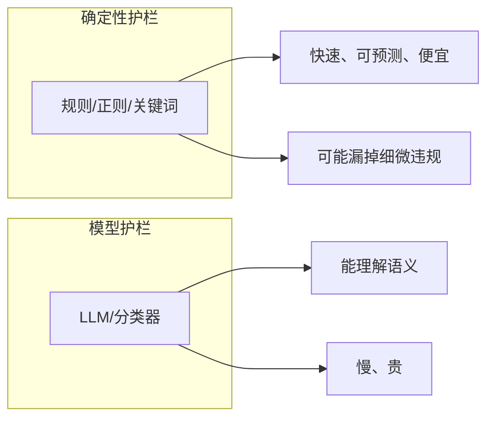
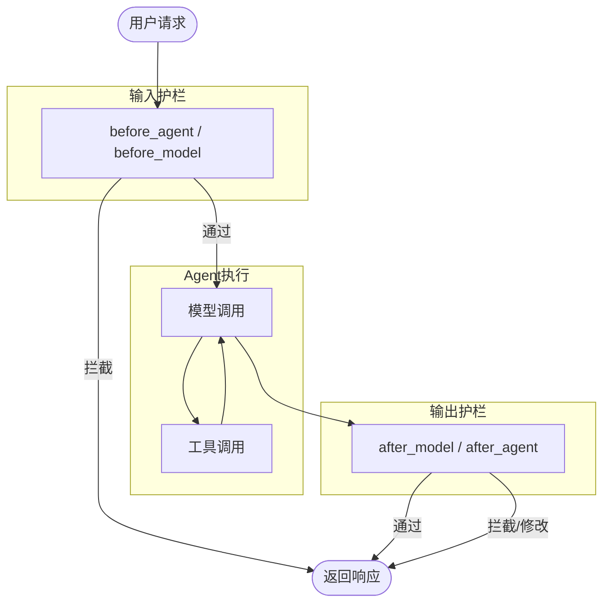

# 护栏详解

护栏（Guardrails）帮助你构建安全、合规的 AI 应用，通过在 Agent 执行的关键点验证和过滤内容。

## 护栏能做什么？

| 用途 | 说明 |
|------|------|
| 防止 PII 泄露 | 检测和处理个人身份信息 |
| 检测提示注入攻击 | 阻止恶意输入 |
| 阻止不当内容 | 过滤有害或不适当的内容 |
| 执行业务规则 | 确保合规要求 |
| 验证输出质量 | 检查输出的准确性 |

## 两种护栏类型



| 类型 | 实现方式 | 优点 | 缺点 |
|------|----------|------|------|
| 确定性护栏 | 正则、关键词、规则 | 快速、可预测、成本低 | 可能漏掉细微违规 |
| 模型护栏 | LLM、分类器 | 能理解语义，捕捉细微问题 | 慢、成本高 |

## 护栏执行位置

护栏通过中间件在 Agent 执行的不同阶段拦截：



## 内置护栏

### PII 检测

检测和处理个人身份信息（PII）。

```python
from langchain.agents import create_agent
from langchain.agents.middleware import PIIMiddleware

agent = create_agent(
    model="gpt-4o",
    tools=[customer_service_tool],
    middleware=[
        # 输入中的邮箱 → 脱敏
        PIIMiddleware("email", strategy="redact", apply_to_input=True),
        # 输入中的信用卡 → 遮盖
        PIIMiddleware("credit_card", strategy="mask", apply_to_input=True),
        # 检测到 API Key → 直接阻止
        PIIMiddleware(
            "api_key",
            detector=r"sk-[a-zA-Z0-9]{32}",
            strategy="block",
            apply_to_input=True,
        ),
    ],
)

# 用户输入包含 PII 时会被处理
result = agent.invoke({
    "messages": [{
        "role": "user", 
        "content": "我的邮箱是 john@example.com，卡号是 5105-1051-0510-5100"
    }]
})
```

**处理策略：**

| 策略 | 效果 | 示例 |
|------|------|------|
| `redact` | 替换为占位符 | `[REDACTED_EMAIL]` |
| `mask` | 部分遮盖 | `****-****-****-5100` |
| `hash` | 替换为哈希 | `a8f5f167...` |
| `block` | 抛出异常 | 直接报错 |

**内置 PII 类型：** `email`、`credit_card`、`ip`、`mac_address`、`url`

### 人工审核

高风险操作需要人工审批。

```python
from langchain.agents import create_agent
from langchain.agents.middleware import HumanInTheLoopMiddleware
from langgraph.checkpoint.memory import InMemorySaver
from langgraph.types import Command

agent = create_agent(
    model="gpt-4o",
    tools=[search_tool, send_email_tool, delete_database_tool],
    middleware=[
        HumanInTheLoopMiddleware(
            interrupt_on={
                "send_email": True,        # 需要审批
                "delete_database": True,   # 需要审批
                "search": False,           # 自动通过
            }
        ),
    ],
    checkpointer=InMemorySaver(),  # 必需
)

config = {"configurable": {"thread_id": "some_id"}}

# Agent 会在敏感操作前暂停
result = agent.invoke(
    {"messages": [{"role": "user", "content": "发送邮件给团队"}]},
    config=config
)

# 人工审批后继续
result = agent.invoke(
    Command(resume={"decisions": [{"type": "approve"}]}),
    config=config
)
```

## 自定义护栏

### 输入护栏（before_agent）

在 Agent 执行前验证请求，适用于：
- 认证检查
- 速率限制
- 阻止不当请求

**关键词过滤示例：**

```python
from typing import Any
from langchain.agents import create_agent, AgentState
from langchain.agents.middleware import before_agent
from langgraph.runtime import Runtime

banned_keywords = ["hack", "exploit", "malware"]

@before_agent(can_jump_to=["end"])
def content_filter(state: AgentState, runtime: Runtime) -> dict[str, Any] | None:
    """确定性护栏：阻止包含禁用关键词的请求"""
    if not state["messages"]:
        return None
    
    first_message = state["messages"][0]
    if first_message.type != "human":
        return None
    
    content = first_message.content.lower()
    
    # 检查禁用关键词
    for keyword in banned_keywords:
        if keyword in content:
            return {
                "messages": [{
                    "role": "assistant",
                    "content": "我无法处理包含不当内容的请求，请重新表述。"
                }],
                "jump_to": "end"  # 直接结束，不执行 Agent
            }
    
    return None

agent = create_agent(
    model="gpt-4o",
    tools=[search_tool],
    middleware=[content_filter],
)

# 这个请求会被拦截
result = agent.invoke({
    "messages": [{"role": "user", "content": "如何 hack 数据库？"}]
})
# 返回: "我无法处理包含不当内容的请求，请重新表述。"
```

### 输出护栏（after_agent）

在 Agent 执行后验证输出，适用于：
- 安全检查
- 质量验证
- 合规扫描

**模型安全检查示例：**

```python
from typing import Any
from langchain.agents import create_agent, AgentState
from langchain.agents.middleware import after_agent
from langchain.messages import AIMessage
from langchain.chat_models import init_chat_model
from langgraph.runtime import Runtime

safety_model = init_chat_model("gpt-4o-mini")

@after_agent(can_jump_to=["end"])
def safety_guardrail(state: AgentState, runtime: Runtime) -> dict[str, Any] | None:
    """模型护栏：使用 LLM 评估响应安全性"""
    if not state["messages"]:
        return None
    
    last_message = state["messages"][-1]
    if not isinstance(last_message, AIMessage):
        return None
    
    # 用模型评估安全性
    safety_prompt = f"""评估这个响应是否安全和适当。
只回答 'SAFE' 或 'UNSAFE'。

响应: {last_message.content}"""
    
    result = safety_model.invoke([{"role": "user", "content": safety_prompt}])
    
    if "UNSAFE" in result.content:
        # 修改不安全的响应
        last_message.content = "我无法提供该响应，请重新表述您的请求。"
    
    return None

agent = create_agent(
    model="gpt-4o",
    tools=[search_tool],
    middleware=[safety_guardrail],
)
```

## 多层护栏组合

可以堆叠多个护栏，按顺序执行，构建分层保护：

```python
from langchain.agents import create_agent
from langchain.agents.middleware import PIIMiddleware, HumanInTheLoopMiddleware

agent = create_agent(
    model="gpt-4o",
    tools=[search_tool, send_email_tool],
    middleware=[
        # 第 1 层：确定性输入过滤（before_agent）
        content_filter,
        
        # 第 2 层：PII 保护（before/after model）
        PIIMiddleware("email", strategy="redact", apply_to_input=True),
        PIIMiddleware("email", strategy="redact", apply_to_output=True),
        
        # 第 3 层：敏感工具人工审批
        HumanInTheLoopMiddleware(interrupt_on={"send_email": True}),
        
        # 第 4 层：模型安全检查（after_agent）
        safety_guardrail,
    ],
)
```

**执行流程：**

```
用户请求
    ↓
[第 1 层] content_filter - 关键词过滤
    ↓ (通过)
[第 2 层] PIIMiddleware - 输入 PII 脱敏
    ↓
Agent 执行（模型 + 工具）
    ↓
[第 3 层] HumanInTheLoopMiddleware - 敏感操作审批
    ↓ (审批通过)
[第 2 层] PIIMiddleware - 输出 PII 脱敏
    ↓
[第 4 层] safety_guardrail - 安全性检查
    ↓ (通过)
返回响应
```

## 确定性 vs 模型护栏：如何选择？

| 场景 | 推荐 | 原因 |
|------|------|------|
| 关键词黑名单 | 确定性 | 快速、准确 |
| PII 检测（邮箱、信用卡） | 确定性 | 正则足够 |
| 判断内容是否有害 | 模型 | 需要理解语义 |
| 判断回答质量 | 模型 | 需要理解上下文 |
| 高频请求 | 确定性 | 成本低 |
| 合规审计 | 两者结合 | 分层保护 |

**最佳实践：先用确定性护栏过滤明显问题，再用模型护栏处理细微问题。**

## 总结

| 概念 | 说明 |
|------|------|
| 确定性护栏 | 规则、正则、关键词，快速便宜 |
| 模型护栏 | LLM 评估，能理解语义 |
| `before_agent` | 输入护栏，拦截不当请求 |
| `after_agent` | 输出护栏，验证响应安全性 |
| `PIIMiddleware` | 内置 PII 检测 |
| `HumanInTheLoopMiddleware` | 人工审批 |
| `jump_to: "end"` | 直接结束，跳过 Agent 执行 |
| 多层护栏 | 组合多个护栏，分层保护 |
