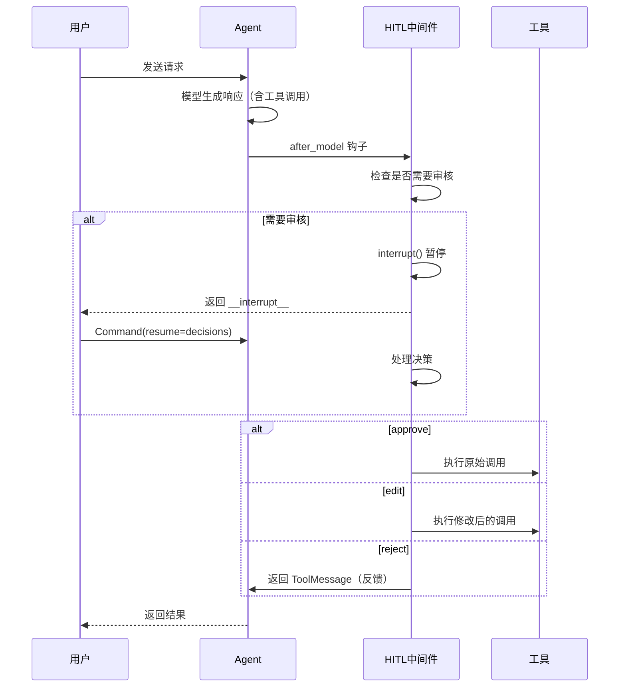

# HITL（人在回路）详解

HITL（Human-in-the-Loop，人在回路）中间件允许在 Agent 执行工具调用前添加人工介入环节。当模型提出可能需要审核的操作（如写文件、执行 SQL）时，中间件会暂停执行并等待人类决策。

## 核心概念

**工作原理：**

```
用户请求
    ↓
Agent 生成工具调用
    ↓
中间件检查是否需要审核
    ↓
需要 → 暂停（interrupt），保存状态
    ↓
人类审核：approve / edit / reject
    ↓
继续执行或返回反馈
```

## 三种决策类型

| 决策 | 说明 | 使用场景 |
|------|------|----------|
| ✅ `approve` | 批准，按原样执行 | 邮件内容没问题，直接发送 |
| ✏️ `edit` | 修改后执行 | 改一下收件人再发送 |
| ❌ `reject` | 拒绝，返回反馈给 Agent | SQL 太危险，告诉 Agent 换个方式 |

## 基本配置

```python
from langchain.agents import create_agent
from langchain.agents.middleware import HumanInTheLoopMiddleware
from langgraph.checkpoint.memory import InMemorySaver

agent = create_agent(
    model="gpt-4o",
    tools=[write_file_tool, execute_sql_tool, read_data_tool],
    middleware=[
        HumanInTheLoopMiddleware(
            interrupt_on={
                # True = 允许所有决策（approve, edit, reject）
                "write_file": True,
                
                # 只允许批准或拒绝，不能编辑
                "execute_sql": {"allowed_decisions": ["approve", "reject"]},
                
                # False = 安全操作，不需要审核
                "read_data": False,
            },
            description_prefix="工具执行待审核",
        ),
    ],
    # 必须配置 checkpointer，用于保存暂停时的状态
    checkpointer=InMemorySaver(),
)
```

> **注意**：必须配置 `checkpointer` 来持久化状态。生产环境使用 `AsyncPostgresSaver`，测试用 `InMemorySaver`。

## 配置选项

| 参数 | 类型 | 说明 |
|------|------|------|
| `interrupt_on` | dict | 工具名 → 审核配置的映射 |
| `description_prefix` | str | 审核请求的描述前缀 |

**interrupt_on 的值：**
- `True` - 需要审核，允许所有决策
- `False` - 不需要审核，自动执行
- `{"allowed_decisions": [...]}` - 需要审核，限制可用决策

## 处理中断

### 触发中断

```python
from langgraph.types import Command

# 必须提供 thread_id，用于关联对话
config = {"configurable": {"thread_id": "conversation_1"}}

# 执行直到遇到中断
result = agent.invoke(
    {"messages": [{"role": "user", "content": "删除30天前的记录"}]},
    config=config
)

# 检查是否有中断
if "__interrupt__" in result:
    print(result["__interrupt__"])
    # Interrupt(value={
    #     'action_requests': [{
    #         'name': 'execute_sql',
    #         'arguments': {'query': 'DELETE FROM records WHERE...'},
    #         'description': '工具执行待审核...'
    #     }],
    #     'review_configs': [{
    #         'action_name': 'execute_sql',
    #         'allowed_decisions': ['approve', 'reject']
    #     }]
    # })
```

### 响应中断

**批准执行：**

```python
agent.invoke(
    Command(resume={"decisions": [{"type": "approve"}]}),
    config=config  # 同一个 thread_id
)
```

**修改后执行：**

```python
agent.invoke(
    Command(resume={"decisions": [{
        "type": "edit",
        "edited_action": {
            "name": "execute_sql",
            "args": {"query": "SELECT * FROM records LIMIT 10"}  # 改成查询
        }
    }]}),
    config=config
)
```

**拒绝并反馈：**

```python
agent.invoke(
    Command(resume={"decisions": [{
        "type": "reject",
        "message": "不能直接删除，请先备份数据"
    }]}),
    config=config
)
```

> `reject` 的 `message` 会作为反馈加入对话，帮助 Agent 理解为什么被拒绝。

### 多个决策

当多个工具调用同时需要审核时，按顺序提供决策：

```python
agent.invoke(
    Command(resume={"decisions": [
        {"type": "approve"},
        {"type": "edit", "edited_action": {"name": "tool_name", "args": {...}}},
        {"type": "reject", "message": "不允许此操作"}
    ]}),
    config=config
)
```

## 流式输出

```python
from langgraph.types import Command

config = {"configurable": {"thread_id": "conversation_1"}}

# 流式执行直到中断
for mode, chunk in agent.stream(
    {"messages": [{"role": "user", "content": "删除旧记录"}]},
    config=config,
    stream_mode=["updates", "messages"],
):
    if mode == "messages":
        token, metadata = chunk
        if token.content:
            print(token.content, end="", flush=True)
    elif mode == "updates":
        if "__interrupt__" in chunk:
            print(f"\n\n中断: {chunk['__interrupt__']}")

# 人类审核后，流式恢复执行
for mode, chunk in agent.stream(
    Command(resume={"decisions": [{"type": "approve"}]}),
    config=config,
    stream_mode=["updates", "messages"],
):
    if mode == "messages":
        token, metadata = chunk
        if token.content:
            print(token.content, end="", flush=True)
```

## 执行生命周期

中间件使用 `after_model` 钩子，在模型生成响应后、工具执行前运行：



## 实际应用场景

这就是 Cursor、Kiro 等 AI 编程工具中 **Accept / Reject** 按钮的实现原理：

```python
# AI 编程助手的配置
agent = create_agent(
    model="gpt-4o",
    tools=[
        write_file,      # 写文件 - 需要审核
        delete_file,     # 删除文件 - 需要审核
        execute_command, # 执行命令 - 需要审核
        read_file,       # 读文件 - 不需要审核
        search_code,     # 搜索代码 - 不需要审核
    ],
    middleware=[
        HumanInTheLoopMiddleware(
            interrupt_on={
                "write_file": True,
                "delete_file": {"allowed_decisions": ["approve", "reject"]},
                "execute_command": True,
                "read_file": False,
                "search_code": False,
            }
        )
    ],
    checkpointer=AsyncPostgresSaver(...),
)
```

## 总结

| 概念 | 说明 |
|------|------|
| HITL | Human-in-the-Loop，人在回路 |
| `interrupt` | 暂停执行，等待人类决策 |
| `approve` | 批准，按原样执行 |
| `edit` | 修改参数后执行 |
| `reject` | 拒绝，返回反馈给 Agent |
| `checkpointer` | 必须配置，用于保存暂停时的状态 |
| `thread_id` | 关联对话，用于恢复执行 |
| `Command` | 用于恢复执行并传递决策 |
