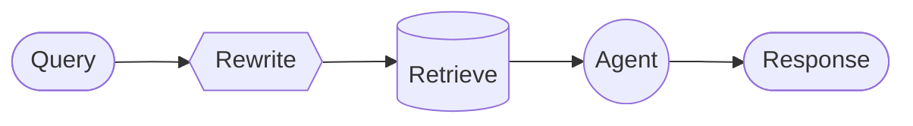

# 多Agent架构详解

多 Agent 系统通过协调多个专门化的组件来处理复杂工作流。但并非所有复杂任务都需要这种方式——单个 Agent 配合合适的工具和提示词通常也能达到类似效果。

## 目录

- [概述](#概述)
- [模式一：Subagents](#模式一subagents)
- [模式二：Handoffs](#模式二handoffs)
- [模式三：Skills](#模式三skills)
- [模式四：Router](#模式四router)
- [模式五：自定义工作流](#模式五自定义工作流)
- [性能对比](#性能对比)
- [总结与最佳实践](#总结与最佳实践)

---

## 概述

### 为什么需要多 Agent？

当开发者说需要"多 Agent"时，通常是在寻找以下能力：

| 需求 | 说明 |
|------|------|
| **上下文管理** | 提供专门知识而不会压垮模型的 context window。如果上下文无限且延迟为零，你可以把所有知识塞进一个 prompt——但现实不是这样，需要模式来选择性地呈现相关信息 |
| **分布式开发** | 允许不同团队独立开发和维护各自的能力，通过清晰的边界组合成更大的系统 |
| **并行化** | 为子任务生成专门的 worker 并发执行，加快结果返回 |

**适用场景：**
- 单个 Agent 工具太多，难以正确选择
- 任务需要专门知识和大量上下文（长 prompt、领域特定工具）
- 需要强制顺序约束，满足条件后才解锁某些能力

> **核心：** 多 Agent 设计的核心是**上下文工程**——决定每个 Agent 看到什么信息。系统质量取决于确保每个 Agent 能访问其任务所需的正确数据。

### 五种模式

| 模式 | 工作方式 |
|------|----------|
| **Subagents** | 主 Agent 把子 Agent 当作工具调用，所有路由都经过主 Agent |
| **Handoffs** | 行为根据状态动态变化，工具调用更新状态变量触发路由或配置变更 |
| **Skills** | 按需加载专门的提示词和知识，单个 Agent 保持控制权 |
| **Router** | 路由步骤分类输入并分发给专门的 Agent，结果合成为统一响应 |
| **Custom workflow** | 用 LangGraph 构建自定义执行流程，混合确定性逻辑和 Agent 行为 |

### 模式选择

| 模式 | 分布式开发 | 并行化 | 多跳 | 直接用户交互 |
|------|:----------:|:------:|:----:|:------------:|
| **Subagents** | ⭐⭐⭐⭐⭐ | ⭐⭐⭐⭐⭐ | ⭐⭐⭐⭐⭐ | ⭐ |
| **Handoffs** | — | — | ⭐⭐⭐⭐⭐ | ⭐⭐⭐⭐⭐ |
| **Skills** | ⭐⭐⭐⭐⭐ | ⭐⭐⭐ | ⭐⭐⭐⭐⭐ | ⭐⭐⭐⭐⭐ |
| **Router** | ⭐⭐⭐ | ⭐⭐⭐⭐⭐ | — | ⭐⭐⭐ |

**指标说明：**
- **分布式开发**：不同团队能否独立维护组件？
- **并行化**：多个 Agent 能否并发执行？
- **多跳**：是否支持串行调用多个子 Agent？
- **直接用户交互**：子 Agent 能否直接与用户对话？

> **提示：** 可以混合使用模式！例如 Subagents 架构可以调用包含自定义工作流或路由 Agent 的工具，Subagents 甚至可以使用 Skills 模式按需加载上下文。

---


## 模式一：Subagents

在 Subagents 架构中，一个中央主 Agent（通常称为 **Supervisor**）通过将子 Agent 作为工具调用来协调它们。主 Agent 决定调用哪个子 Agent、提供什么输入、如何组合结果。

子 Agent 是**无状态**的——它们不记住过去的交互，所有对话记忆由主 Agent 维护。这提供了**上下文隔离**：每次子 Agent 调用都在干净的 context window 中工作，防止主对话的上下文膨胀。


### 核心特征

| 特征 | 说明 |
|------|------|
| 集中控制 | 所有路由都经过主 Agent |
| 无直接用户交互 | 子 Agent 返回结果给主 Agent，而非用户 |
| 工具形式调用 | 子 Agent 通过工具被调用 |
| 并行执行 | 主 Agent 可以在单轮中调用多个子 Agent |

> **Supervisor vs Router**：Supervisor Agent（本模式）与 Router 不同。Supervisor 是完整的 Agent，维护对话上下文并动态决定跨多轮调用哪些子 Agent。Router 通常是单次分类步骤，分发给 Agent 但不维护持续的对话状态。

### 适用场景

- 有多个不同领域（如日历、邮件、CRM、数据库）
- 子 Agent 不需要直接与用户对话
- 需要集中的工作流控制

> **提示**：如果子 Agent 需要用户交互，可以在子 Agent 内使用 `interrupt` 暂停执行并收集用户输入。主 Agent 仍是协调者，但子 Agent 可以在任务中途收集用户信息。

### 基本实现

核心机制是将子 Agent 包装为主 Agent 可以调用的工具：

```python
from langchain.tools import tool
from langchain.agents import create_agent

# 创建子 Agent
subagent = create_agent(
    model="gpt-4o",
    tools=[...]
)

# 包装为工具
@tool("research", description="研究某个主题并返回发现")
def call_research_agent(query: str):
    result = subagent.invoke({
        "messages": [{"role": "user", "content": query}]
    })
    return result["messages"][-1].content

# 主 Agent 使用子 Agent 作为工具
main_agent = create_agent(
    model="gpt-4o",
    tools=[call_research_agent]
)
```

### 设计决策

| 决策 | 选项 |
|------|------|
| 同步 vs 异步 | 同步（阻塞）vs 异步（后台） |
| 工具模式 | 每个 Agent 一个工具 vs 单一分发工具 |
| 子 Agent 输入 | 仅查询 vs 完整上下文 |
| 子 Agent 输出 | 子 Agent 结果 vs 完整对话历史 |

### 同步 vs 异步

#### 同步（默认）

主 Agent 等待每个子 Agent 完成后再继续。


**适用场景：**
- 主 Agent 的下一步动作依赖子 Agent 的结果
- 任务有顺序依赖（获取数据 → 分析 → 响应）
- 子 Agent 失败应阻止主 Agent 响应

**权衡：**
- 实现简单——调用并等待
- 用户在所有子 Agent 完成前看不到响应
- 长时间运行的任务会冻结对话

#### 异步

子 Agent 的工作独立于主对话流——主 Agent 启动后台任务并保持响应。


**适用场景：**
- 子 Agent 工作独立于主对话流
- 用户应该能在工作进行时继续聊天
- 需要并行运行多个独立任务

**三工具模式：**
1. **启动任务**：启动后台任务，返回 job_id
2. **检查状态**：返回当前状态（pending、running、completed、failed）
3. **获取结果**：获取完成的结果

### 工具模式

#### 每个 Agent 一个工具

每个子 Agent 包装为独立的工具：

```python
from langchain.tools import tool
from langchain.agents import create_agent

# 创建子 Agent
research_agent = create_agent(model="gpt-4o", tools=[...])
writer_agent = create_agent(model="gpt-4o", tools=[...])

# 每个子 Agent 一个工具
@tool("research", description="研究和事实查找")
def call_research(query: str):
    result = research_agent.invoke({"messages": [{"role": "user", "content": query}]})
    return result["messages"][-1].content

@tool("write", description="内容创作和编辑")
def call_writer(query: str):
    result = writer_agent.invoke({"messages": [{"role": "user", "content": query}]})
    return result["messages"][-1].content

# 主 Agent
main_agent = create_agent(
    model="gpt-4o",
    tools=[call_research, call_writer]
)
```

**优点：** 对每个子 Agent 的输入/输出有细粒度控制
**缺点：** 设置更多，但定制性更强

#### 单一分发工具

使用单个参数化工具调用任何注册的子 Agent：


```python
from langchain.tools import tool
from langchain.agents import create_agent

# 子 Agent 注册表
SUBAGENTS = {
    "research": create_agent(model="gpt-4o", prompt="你是研究专家..."),
    "writer": create_agent(model="gpt-4o", prompt="你是写作专家..."),
}

@tool
def task(agent_name: str, description: str) -> str:
    """启动子 Agent 执行任务。
    
    可用 Agent：
    - research: 研究和事实查找
    - writer: 内容创作和编辑
    """
    agent = SUBAGENTS[agent_name]
    result = agent.invoke({
        "messages": [{"role": "user", "content": description}]
    })
    return result["messages"][-1].content

# 主协调 Agent
main_agent = create_agent(
    model="gpt-4o",
    tools=[task],
    prompt="你协调专门的子 Agent。使用 task 工具委派工作。"
)
```

**优点：** 
- 可扩展地添加新 Agent 而无需修改协调器
- 不同团队可以独立开发和部署 Agent
- 强上下文隔离

**缺点：** 每个 Agent 的定制性较少

> **关键洞察**：调用子 Agent 的主要原因是**上下文隔离**——允许复杂的多步骤任务在隔离的 context window 中运行，而不会膨胀主 Agent 的对话历史。

### 上下文工程

控制上下文如何在主 Agent 和子 Agent 之间流动：

| 类别 | 目的 | 影响 |
|------|------|------|
| 子 Agent 规格 | 确保子 Agent 在应该被调用时被调用 | 主 Agent 路由决策 |
| 子 Agent 输入 | 确保子 Agent 能用优化的上下文良好执行 | 子 Agent 性能 |
| 子 Agent 输出 | 确保主 Agent 能根据子 Agent 结果行动 | 主 Agent 性能 |

#### 子 Agent 规格

**名称**和**描述**是主 Agent 知道调用哪个子 Agent 的主要方式：

- **名称**：主 Agent 如何引用子 Agent。保持清晰和面向动作（如 `research_agent`、`code_reviewer`）
- **描述**：主 Agent 对子 Agent 能力的了解。具体说明它处理什么任务以及何时使用

#### 子 Agent 输入

自定义子 Agent 接收什么上下文来执行任务：

```python
from langchain.agents import AgentState
from langchain.tools import tool, ToolRuntime

class CustomState(AgentState):
    example_state_key: str

@tool("subagent_name", description="子 Agent 描述")
def call_subagent(query: str, runtime: ToolRuntime[None, CustomState]):
    # 应用任何需要的逻辑来转换消息为合适的输入
    subagent_input = some_logic(query, runtime.state["messages"])
    
    result = subagent.invoke({
        "messages": subagent_input,
        # 也可以传递其他状态键
        "example_state_key": runtime.state["example_state_key"]
    })
    return result["messages"][-1].content
```

#### 子 Agent 输出

自定义主 Agent 收到什么以便做出好的决策：

**方法 1：提示子 Agent**

指定应该返回什么。常见失败模式是子 Agent 执行工具调用或推理但不在最终消息中包含结果——提醒它 Supervisor 只看到最终输出。

**方法 2：代码中格式化**

在返回前调整或丰富响应：

```python
from typing import Annotated
from langchain.agents import AgentState
from langchain.tools import InjectedToolCallId
from langgraph.types import Command

@tool("subagent_name", description="子 Agent 描述")
def call_subagent(
    query: str,
    tool_call_id: Annotated[str, InjectedToolCallId],
) -> Command:
    result = subagent.invoke({
        "messages": [{"role": "user", "content": query}]
    })
    
    return Command(update={
        # 从子 Agent 传回额外状态
        "example_state_key": result["example_state_key"],
        "messages": [ToolMessage(
            content=result["messages"][-1].content,
            tool_call_id=tool_call_id
        )]
    })
```

---


## 模式二：Handoffs

在 Handoffs 架构中，行为根据状态动态变化。核心机制：工具更新一个状态变量（如 `current_step` 或 `active_agent`），该变量跨轮次持久化，系统读取这个变量来调整行为——要么应用不同的配置（system prompt、工具），要么路由到不同的 Agent。

这种模式支持不同 Agent 之间的交接，也支持单个 Agent 内的动态配置变更。

> **术语来源**：Handoffs 一词由 OpenAI 提出，指使用工具调用（如 `transfer_to_sales_agent`）在 Agent 或状态之间转移控制权。


### 核心特征

| 特征 | 说明 |
|------|------|
| 状态驱动行为 | 行为根据状态变量（如 `current_step`）变化 |
| 工具触发转换 | 工具更新状态变量来切换状态 |
| 直接用户交互 | 每个状态的配置直接处理用户消息 |
| 持久状态 | 状态跨对话轮次保持 |

### 适用场景

- 需要强制顺序约束（满足前置条件后才解锁能力）
- Agent 需要在不同状态下直接与用户对话
- 构建多阶段对话流程

**典型场景**：客服场景中需要按特定顺序收集信息——例如，处理退款前必须先收集保修 ID。

### 基本实现

核心机制是工具返回 `Command` 来更新状态，触发转换到新步骤或 Agent：

```python
from langchain.tools import tool
from langchain.messages import ToolMessage
from langgraph.types import Command

@tool
def transfer_to_specialist(runtime) -> Command:
    """转移到专家 Agent"""
    return Command(update={
        "messages": [ToolMessage(
            content="已转移到专家",
            tool_call_id=runtime.tool_call_id
        )],
        "current_step": "specialist"  # 触发行为变更
    })
```

> **为什么需要 ToolMessage？** 当 LLM 调用工具时，它期望收到响应。带有匹配 `tool_call_id` 的 `ToolMessage` 完成这个请求-响应循环——没有它，对话历史会变得畸形。

### 实现方式

有两种实现 Handoffs 的方式：

| 方式 | 说明 | 适用场景 |
|------|------|----------|
| 单 Agent + 中间件 | 一个 Agent 动态配置 | 大多数场景，更简单 |
| 多 Agent 子图 | 不同 Agent 作为图节点 | 需要复杂 Agent 实现时 |

#### 方式一：单 Agent + 中间件

单个 Agent 根据状态改变行为。中间件拦截每次模型调用，动态调整 system prompt 和可用工具。


```python
from langchain.agents import AgentState, create_agent
from langchain.agents.middleware import wrap_model_call, ModelRequest, ModelResponse
from langchain.tools import tool, ToolRuntime
from langchain.messages import ToolMessage
from langgraph.types import Command
from typing import Callable

# 1. 定义状态，包含 current_step 追踪器
class SupportState(AgentState):
    """追踪当前活动的步骤"""
    current_step: str = "triage"
    warranty_status: str | None = None

# 2. 工具通过 Command 更新 current_step
@tool
def record_warranty_status(
    status: str,
    runtime: ToolRuntime[None, SupportState]
) -> Command:
    """记录保修状态并转换到下一步"""
    return Command(update={
        "messages": [ToolMessage(
            content=f"保修状态已记录: {status}",
            tool_call_id=runtime.tool_call_id
        )],
        "warranty_status": status,
        "current_step": "specialist"  # 转换到下一步
    })

@tool
def provide_solution(issue: str, runtime: ToolRuntime) -> str:
    """提供解决方案"""
    return f"针对 {issue} 的解决方案..."

@tool
def escalate(reason: str, runtime: ToolRuntime) -> str:
    """升级到人工"""
    return f"已升级: {reason}"

# 3. 中间件根据 current_step 应用动态配置
@wrap_model_call
def apply_step_config(
    request: ModelRequest,
    handler: Callable[[ModelRequest], ModelResponse]
) -> ModelResponse:
    """根据 current_step 配置 Agent 行为"""
    step = request.state.get("current_step", "triage")
    
    # 步骤到配置的映射
    configs = {
        "triage": {
            "prompt": "收集保修信息...",
            "tools": [record_warranty_status]
        },
        "specialist": {
            "prompt": "根据保修状态 {warranty_status} 提供解决方案",
            "tools": [provide_solution, escalate]
        }
    }
    
    config = configs[step]
    request = request.override(
        system_prompt=config["prompt"].format(**request.state),
        tools=config["tools"]
    )
    return handler(request)

# 4. 创建带中间件的 Agent
agent = create_agent(
    model="gpt-4o",
    tools=[record_warranty_status, provide_solution, escalate],
    state_schema=SupportState,
    middleware=[apply_step_config],
    checkpointer=InMemorySaver()  # 跨轮次持久化状态
)
```

#### 方式二：多 Agent 子图

多个不同的 Agent 作为图中的独立节点存在。Handoff 工具使用 `Command.PARENT` 导航到其他 Agent 节点。


> **警告**：子图 Handoffs 需要仔细的**上下文工程**。与单 Agent 中间件（消息历史自然流动）不同，你必须明确决定什么消息在 Agent 之间传递。

```python
from typing import Literal
from langchain.agents import AgentState, create_agent
from langchain.messages import AIMessage, ToolMessage
from langchain.tools import tool, ToolRuntime
from langgraph.graph import StateGraph, START, END
from langgraph.types import Command
from typing_extensions import NotRequired

# 1. 定义状态，包含 active_agent 追踪器
class MultiAgentState(AgentState):
    active_agent: NotRequired[str]

# 2. 创建 Handoff 工具
@tool
def transfer_to_sales(runtime: ToolRuntime) -> Command:
    """转移到销售 Agent"""
    # 获取触发此 handoff 的 AI 消息
    last_ai_message = next(
        msg for msg in reversed(runtime.state["messages"]) 
        if isinstance(msg, AIMessage)
    )
    # 创建人工工具响应来完成配对
    transfer_message = ToolMessage(
        content="已从支持 Agent 转移到销售 Agent",
        tool_call_id=runtime.tool_call_id,
    )
    return Command(
        goto="sales_agent",
        update={
            "active_agent": "sales_agent",
            "messages": [last_ai_message, transfer_message],
        },
        graph=Command.PARENT,
    )

@tool
def transfer_to_support(runtime: ToolRuntime) -> Command:
    """转移到支持 Agent"""
    last_ai_message = next(
        msg for msg in reversed(runtime.state["messages"]) 
        if isinstance(msg, AIMessage)
    )
    transfer_message = ToolMessage(
        content="已从销售 Agent 转移到支持 Agent",
        tool_call_id=runtime.tool_call_id,
    )
    return Command(
        goto="support_agent",
        update={
            "active_agent": "support_agent",
            "messages": [last_ai_message, transfer_message],
        },
        graph=Command.PARENT,
    )

# 3. 创建带 Handoff 工具的 Agent
sales_agent = create_agent(
    model="gpt-4o",
    tools=[transfer_to_support],
    prompt="你是销售 Agent。处理销售咨询。如果被问到技术问题，转移到支持 Agent。",
)

support_agent = create_agent(
    model="gpt-4o",
    tools=[transfer_to_sales],
    prompt="你是支持 Agent。处理技术问题。如果被问到价格或购买，转移到销售 Agent。",
)

# 4. 创建调用 Agent 的节点
def call_sales_agent(state: MultiAgentState) -> Command:
    response = sales_agent.invoke(state)
    return response

def call_support_agent(state: MultiAgentState) -> Command:
    response = support_agent.invoke(state)
    return response

# 5. 创建路由器
def route_after_agent(
    state: MultiAgentState,
) -> Literal["sales_agent", "support_agent", "__end__"]:
    """根据 active_agent 路由，或在 Agent 完成时结束"""
    messages = state.get("messages", [])
    if messages:
        last_msg = messages[-1]
        # 如果最后消息是没有工具调用的 AIMessage，结束
        if isinstance(last_msg, AIMessage) and not last_msg.tool_calls:
            return "__end__"
    # 否则路由到活动 Agent
    active = state.get("active_agent", "sales_agent")
    return active if active else "sales_agent"

def route_initial(
    state: MultiAgentState,
) -> Literal["sales_agent", "support_agent"]:
    """根据状态路由到活动 Agent，默认销售 Agent"""
    return state.get("active_agent") or "sales_agent"

# 6. 构建图
builder = StateGraph(MultiAgentState)
builder.add_node("sales_agent", call_sales_agent)
builder.add_node("support_agent", call_support_agent)

# 基于初始 active_agent 的条件路由
builder.add_conditional_edges(START, route_initial, ["sales_agent", "support_agent"])

# 每个 Agent 后检查是否结束或路由到另一个 Agent
builder.add_conditional_edges(
    "sales_agent", 
    route_after_agent, 
    ["sales_agent", "support_agent", END]
)
builder.add_conditional_edges(
    "support_agent", 
    route_after_agent, 
    ["sales_agent", "support_agent", END]
)

graph = builder.compile()
```

### 上下文工程

使用子图 Handoffs 时，你控制 Agent 之间传递什么消息。这对于维护有效的对话历史和避免上下文膨胀至关重要。

#### Handoff 时处理上下文

LLM 期望工具调用与其响应配对。使用 `Command.PARENT` 交接时，必须包含：

1. **包含工具调用的 AIMessage**（触发 handoff 的消息）
2. **确认 handoff 的 ToolMessage**（对该工具调用的人工响应）

```python
@tool
def transfer_to_sales(runtime: ToolRuntime) -> Command:
    # 获取触发此 handoff 的 AI 消息
    last_ai_message = runtime.state["messages"][-1]
    
    # 创建人工工具响应来完成配对
    transfer_message = ToolMessage(
        content="已转移到销售 Agent",
        tool_call_id=runtime.tool_call_id,
    )
    
    return Command(
        goto="sales_agent",
        update={
            "active_agent": "sales_agent",
            # 只传递这两条消息，而非完整子 Agent 历史
            "messages": [last_ai_message, transfer_message],
        },
        graph=Command.PARENT,
    )
```

> **为什么不传递所有子 Agent 消息？** 虽然可以在 handoff 中包含完整的子 Agent 对话，但这通常会造成问题。接收 Agent 可能被无关的内部推理搞混，token 成本也会不必要地增加。只传递 handoff 配对，可以让父图的上下文专注于高层协调。

#### 返回控制给用户

当返回控制给用户（结束 Agent 轮次）时，确保最后消息是 `AIMessage`。这维护了有效的对话历史，并向用户界面发出 Agent 已完成工作的信号。

### 实现考虑

| 考虑点 | 说明 |
|--------|------|
| 上下文过滤策略 | 每个 Agent 接收完整对话历史、过滤部分还是摘要？ |
| 工具语义 | Handoff 工具只更新路由状态，还是也执行副作用？ |
| Token 效率 | 平衡上下文完整性和 token 成本 |

---


## 模式三：Skills

在 Skills 架构中，专门化的能力被打包为可调用的"技能"来增强 Agent 的行为。Skills 主要是提示词驱动的专门化，Agent 可以按需调用。

> **概念来源**：这个模式在概念上与 llms.txt（由 Jeremy Howard 提出）相同，使用工具调用来渐进式披露文档。Skills 模式将同样的方法应用于专门的提示词和领域知识，而不仅仅是文档页面。


### 核心特征

| 特征 | 说明 |
|------|------|
| 提示词驱动专门化 | Skills 主要由专门的提示词定义 |
| 渐进式披露 | Skills 根据上下文或用户需求变得可用 |
| 团队分布 | 不同团队可以独立开发和维护 Skills |
| 轻量级组合 | Skills 比完整的子 Agent 更简单 |

### 适用场景

- 单个 Agent 需要多种可能的专门化
- 不需要在 Skills 之间强制特定约束
- 不同团队需要独立开发能力

**常见示例：**
- **编程助手**：不同语言或任务的 Skills
- **知识库**：不同领域的 Skills
- **创意助手**：不同格式的 Skills

### 基本实现

```python
from langchain.tools import tool
from langchain.agents import create_agent

@tool
def load_skill(skill_name: str) -> str:
    """加载专门化的 Skill 提示词。
    
    可用 Skills：
    - write_sql: SQL 查询编写专家
    - review_legal_doc: 法律文档审核员
    
    返回 Skill 的提示词和上下文。
    """
    skills = {
        "write_sql": """
你是 SQL 查询编写专家。
- 始终使用参数化查询防止 SQL 注入
- 优先使用 JOIN 而非子查询
- 为复杂查询添加注释
- 考虑索引优化
        """,
        "review_legal_doc": """
你是法律文档审核专家。
- 识别关键条款和风险点
- 检查合规性问题
- 标注需要律师审核的部分
- 使用清晰的法律术语
        """
    }
    return skills.get(skill_name, "未找到该 Skill")

agent = create_agent(
    model="gpt-4o",
    tools=[load_skill],
    prompt=(
        "你是一个有帮助的助手。"
        "你可以访问两个 Skills：write_sql 和 review_legal_doc。"
        "使用 load_skill 来加载它们。"
    ),
)
```

### 工作流程


### 扩展模式

#### 动态工具注册

结合渐进式披露和状态管理，在加载 Skills 时注册新工具：

```python
from langchain.tools import tool, ToolRuntime
from langchain.agents import AgentState
from langgraph.types import Command

class SkillState(AgentState):
    loaded_skills: list[str] = []
    available_tools: list = []

@tool
def load_database_admin_skill(runtime: ToolRuntime[None, SkillState]) -> Command:
    """加载数据库管理 Skill，同时注册相关工具"""
    
    # Skill 提示词
    skill_prompt = """
你现在是数据库管理专家。
- 可以执行备份、恢复、迁移操作
- 监控数据库性能
- 优化查询和索引
    """
    
    # 注册新工具
    new_tools = [backup_database, restore_database, migrate_schema]
    
    return Command(update={
        "messages": [ToolMessage(
            content=skill_prompt,
            tool_call_id=runtime.tool_call_id
        )],
        "loaded_skills": runtime.state["loaded_skills"] + ["database_admin"],
        "available_tools": runtime.state["available_tools"] + new_tools,
    })

@tool
def backup_database(database_name: str) -> str:
    """备份数据库"""
    return f"数据库 {database_name} 备份完成"

@tool
def restore_database(database_name: str, backup_id: str) -> str:
    """恢复数据库"""
    return f"数据库 {database_name} 已从 {backup_id} 恢复"

@tool
def migrate_schema(source: str, target: str) -> str:
    """迁移数据库 schema"""
    return f"Schema 已从 {source} 迁移到 {target}"
```

#### 层级 Skills

Skills 可以在树结构中定义其他 Skills，创建嵌套的专门化：


```python
@tool
def load_skill(skill_name: str) -> str:
    """加载 Skill，支持层级结构"""
    
    skills = {
        # 顶级 Skill
        "data_science": """
你是数据科学专家。可用子 Skills：
- pandas_expert: Pandas 数据处理
- visualization: 数据可视化
- statistical_analysis: 统计分析

使用 load_skill 加载子 Skill 获取更详细的知识。
        """,
        
        # 子 Skills
        "pandas_expert": """
你是 Pandas 专家。
- 高效使用 DataFrame 操作
- 数据清洗和转换
- 处理缺失值和异常值
- 性能优化技巧
        """,
        
        "visualization": """
你是数据可视化专家。
- matplotlib 基础图表
- plotly 交互式图表
- seaborn 统计图表
- 选择合适的图表类型
        """,
        
        "statistical_analysis": """
你是统计分析专家。
- 描述性统计
- 假设检验
- 回归分析
- 时间序列分析
        """,
    }
    
    return skills.get(skill_name, "未找到该 Skill")
```

### Skills vs Subagents 对比

| 特性 | Skills | Subagents |
|------|--------|-----------|
| 复杂度 | 轻量级，主要是提示词 | 完整的 Agent，有自己的工具 |
| 上下文 | 加载到当前 Agent 上下文 | 独立的上下文窗口 |
| 控制权 | 始终在主 Agent | 子 Agent 独立执行 |
| 适用场景 | 知识/提示词专门化 | 复杂任务委派 |

---


## 模式四：Router

在 Router 架构中，路由步骤对输入进行分类并将其分发给专门的 Agent。当你有不同的**垂直领域**——每个领域都需要自己的 Agent 的独立知识域时，这种模式非常有用。


### 核心特征

| 特征 | 说明 |
|------|------|
| 查询分解 | Router 分解查询 |
| 并行调用 | 零个或多个专门 Agent 并行调用 |
| 结果合成 | 结果合成为连贯的响应 |

### 适用场景

- 有不同的垂直领域（每个领域需要自己的 Agent）
- 需要并行查询多个来源
- 想要将结果合成为组合响应

### 基本实现

Router 对查询进行分类并将其分发给适当的 Agent。使用 `Command` 进行单 Agent 路由，或使用 `Send` 进行并行扇出到多个 Agent。

#### 单 Agent 路由

使用 `Command` 路由到单个专门 Agent：


```python
from langgraph.types import Command

def classify_query(query: str) -> str:
    """使用 LLM 分类查询并确定适当的 Agent"""
    # 分类逻辑...
    pass

def route_query(state: State) -> Command:
    """根据查询分类路由到适当的 Agent"""
    active_agent = classify_query(state["query"])
    # 路由到选定的 Agent
    return Command(goto=active_agent)
```

#### 多 Agent 并行路由

使用 `Send` 并行扇出到多个专门 Agent：


```python
from typing import TypedDict
from langgraph.types import Send

class ClassificationResult(TypedDict):
    query: str
    agent: str

def classify_query(query: str) -> list[ClassificationResult]:
    """使用 LLM 分类查询并确定要调用哪些 Agent"""
    # 分类逻辑...
    pass

def route_query(state: State):
    """根据查询分类路由到相关 Agent"""
    classifications = classify_query(state["query"])
    
    # 并行扇出到选定的 Agent
    return [
        Send(c["agent"], {"query": c["query"]})
        for c in classifications
    ]
```

### 完整示例：多源知识库

```python
from typing import TypedDict, Annotated
from langchain.agents import create_agent
from langgraph.graph import StateGraph, START, END
from langgraph.types import Send
import operator

# 1. 定义状态
class RouterState(TypedDict):
    query: str
    results: Annotated[list[str], operator.add]  # 收集所有结果
    final_answer: str

class AgentInput(TypedDict):
    query: str

# 2. 创建专门 Agent
github_agent = create_agent(
    model="gpt-4o",
    tools=[search_github],
    prompt="你是 GitHub 搜索专家。搜索代码和仓库。"
)

notion_agent = create_agent(
    model="gpt-4o",
    tools=[search_notion],
    prompt="你是 Notion 搜索专家。搜索文档和笔记。"
)

slack_agent = create_agent(
    model="gpt-4o",
    tools=[search_slack],
    prompt="你是 Slack 搜索专家。搜索消息和对话。"
)

# 3. 路由函数
def route_query(state: RouterState):
    """分类查询并并行分发到相关 Agent"""
    query = state["query"]
    
    # 简单分类逻辑（实际可用 LLM）
    agents_to_call = []
    
    if "代码" in query or "code" in query.lower():
        agents_to_call.append(("github_agent", query))
    if "文档" in query or "doc" in query.lower():
        agents_to_call.append(("notion_agent", query))
    if "讨论" in query or "消息" in query:
        agents_to_call.append(("slack_agent", query))
    
    # 默认查询所有
    if not agents_to_call:
        agents_to_call = [
            ("github_agent", query),
            ("notion_agent", query),
            ("slack_agent", query),
        ]
    
    # 并行扇出
    return [Send(agent, {"query": q}) for agent, q in agents_to_call]

# 4. Agent 节点
def call_github(state: AgentInput) -> dict:
    result = github_agent.invoke({"messages": [{"role": "user", "content": state["query"]}]})
    return {"results": [f"GitHub: {result['messages'][-1].content}"]}

def call_notion(state: AgentInput) -> dict:
    result = notion_agent.invoke({"messages": [{"role": "user", "content": state["query"]}]})
    return {"results": [f"Notion: {result['messages'][-1].content}"]}

def call_slack(state: AgentInput) -> dict:
    result = slack_agent.invoke({"messages": [{"role": "user", "content": state["query"]}]})
    return {"results": [f"Slack: {result['messages'][-1].content}"]}

# 5. 合成函数
def synthesize(state: RouterState) -> dict:
    """合成所有 Agent 的结果"""
    results = state["results"]
    
    # 使用 LLM 合成结果
    synthesis_prompt = f"""
基于以下来源的搜索结果，提供一个综合答案：

{chr(10).join(results)}

原始问题：{state["query"]}
    """
    
    # 调用 LLM 合成
    final_answer = llm.invoke(synthesis_prompt)
    return {"final_answer": final_answer}

# 6. 构建图
builder = StateGraph(RouterState)

# 添加节点
builder.add_node("github_agent", call_github)
builder.add_node("notion_agent", call_notion)
builder.add_node("slack_agent", call_slack)
builder.add_node("synthesize", synthesize)

# 添加边
builder.add_conditional_edges(START, route_query, ["github_agent", "notion_agent", "slack_agent"])
builder.add_edge("github_agent", "synthesize")
builder.add_edge("notion_agent", "synthesize")
builder.add_edge("slack_agent", "synthesize")
builder.add_edge("synthesize", END)

router = builder.compile()

# 使用
result = router.invoke({"query": "找一下关于用户认证的代码和文档"})
print(result["final_answer"])
```

### 无状态 vs 有状态

| 类型 | 说明 | 适用场景 |
|------|------|----------|
| 无状态 | 每个请求独立路由，无跨调用记忆 | 单次查询 |
| 有状态 | 跨请求维护对话历史 | 多轮对话 |

#### 无状态 Router

每个请求独立路由——调用之间没有记忆。

> **Router vs Subagents**：两种模式都可以将工作分发给多个 Agent，但路由决策方式不同：
> - **Router**：专门的路由步骤（通常是单次 LLM 调用或基于规则的逻辑）分类输入并分发给 Agent。Router 本身通常不维护对话历史——它是预处理步骤。
> - **Subagents**：主 Supervisor Agent 动态决定调用哪些子 Agent 作为持续对话的一部分。主 Agent 维护上下文，可以跨轮次调用多个子 Agent。

#### 有状态 Router

对于多轮对话，需要跨调用维护上下文。

**方式一：工具包装器**

最简单的方法：将无状态 Router 包装为对话 Agent 可以调用的工具。对话 Agent 处理记忆和上下文；Router 保持无状态。

```python
from langchain.tools import tool
from langchain.agents import create_agent

@tool
def search_docs(query: str) -> str:
    """跨多个文档源搜索"""
    result = router.invoke({"query": query})
    return result["final_answer"]

# 对话 Agent 使用 Router 作为工具
conversational_agent = create_agent(
    model="gpt-4o",
    tools=[search_docs],
    prompt="你是一个有帮助的助手。使用 search_docs 回答问题。",
    checkpointer=InMemorySaver(),  # 维护对话历史
)
```


**方式二：完整持久化**

如果需要 Router 本身维护状态，使用持久化存储消息历史。

> **警告**：有状态 Router 需要自定义历史管理。如果 Router 跨轮次在 Agent 之间切换，当 Agent 有不同的语气或提示词时，对话可能对用户感觉不流畅。考虑使用 Handoffs 模式或 Subagents 模式——两者都为多轮对话提供更清晰的语义。

### Router vs 其他模式

| 特性 | Router | Subagents | Handoffs |
|------|--------|-----------|----------|
| 路由决策 | 预处理步骤 | 主 Agent 动态决定 | 状态驱动 |
| 对话历史 | 通常无状态 | 主 Agent 维护 | 跨状态持久化 |
| 并行执行 | ✅ 原生支持 | ✅ 支持 | ❌ 串行 |
| 多轮对话 | 需要包装 | 原生支持 | 原生支持 |
| 适用场景 | 分类 + 并行查询 | 复杂协调 | 顺序工作流 |

---


## 模式五：自定义工作流

在自定义工作流架构中，你使用 LangGraph 定义自己的执行流程。你对图结构有完全的控制——包括顺序步骤、条件分支、循环和并行执行。


### 核心特征

| 特征 | 说明 |
|------|------|
| 完全控制 | 对图结构有完全控制 |
| 混合逻辑 | 混合确定性逻辑和 Agent 行为 |
| 灵活结构 | 支持顺序步骤、条件分支、循环和并行执行 |
| 可组合 | 可以将其他模式嵌入为工作流中的节点 |

### 适用场景

- 标准模式（Subagents、Skills 等）不符合需求
- 需要混合确定性逻辑和 Agent 行为
- 用例需要复杂路由或多阶段处理

工作流中的每个节点可以是：
- 简单函数
- LLM 调用
- 带工具的完整 Agent
- 其他架构（如多 Agent 系统作为单个节点）

### 基本实现

核心洞察：你可以在任何 LangGraph 节点内直接调用 LangChain Agent，结合自定义工作流的灵活性和预构建 Agent 的便利性。

```python
from langchain.agents import create_agent
from langgraph.graph import StateGraph, START, END

agent = create_agent(model="gpt-4o", tools=[...])

def agent_node(state: State) -> dict:
    """调用 LangChain Agent 的 LangGraph 节点"""
    result = agent.invoke({
        "messages": [{"role": "user", "content": state["query"]}]
    })
    return {"answer": result["messages"][-1].content}

# 构建简单工作流
workflow = (
    StateGraph(State)
    .add_node("agent", agent_node)
    .add_edge(START, "agent")
    .add_edge("agent", END)
    .compile()
)
```

### 节点类型


| 节点类型 | 说明 | 示例 |
|----------|------|------|
| Model 节点 | 直接 LLM 调用 | 查询重写、分类 |
| Deterministic 节点 | 确定性逻辑，无 LLM | 向量检索、数据处理 |
| Agent 节点 | 带工具的完整 Agent | 推理 + 工具调用 |

### 示例：RAG 管道

一个常见用例是将检索与 Agent 结合。这个示例构建一个 WNBA 统计助手，从知识库检索并可以获取实时新闻。



**工作流说明：**
- **Rewrite（Model 节点）**：使用结构化输出重写用户查询以获得更好的检索
- **Retrieve（Deterministic 节点）**：执行向量相似性搜索——不涉及 LLM
- **Agent（Agent 节点）**：对检索到的上下文进行推理，可以通过工具获取额外信息

```python
from typing import TypedDict
from pydantic import BaseModel
from langgraph.graph import StateGraph, START, END
from langchain.agents import create_agent
from langchain.tools import tool
from langchain_openai import ChatOpenAI, OpenAIEmbeddings
from langchain_core.vectorstores import InMemoryVectorStore

# 1. 定义状态
class State(TypedDict):
    question: str
    rewritten_query: str
    documents: list[str]
    answer: str

# 2. 设置知识库
embeddings = OpenAIEmbeddings()
vector_store = InMemoryVectorStore(embeddings)
vector_store.add_texts([
    # 球队阵容
    "纽约自由人 2024 阵容：Breanna Stewart, Sabrina Ionescu, Jonquel Jones",
    "拉斯维加斯王牌 2024 阵容：A'ja Wilson, Kelsey Plum, Jackie Young",
    "印第安纳狂热 2024 阵容：Caitlin Clark, Aliyah Boston, Kelsey Mitchell",
    # 比赛结果
    "2024 WNBA 总决赛：纽约自由人 3-2 击败明尼苏达山猫夺冠",
    "2024年6月15日：印第安纳狂热 85, 芝加哥天空 79。Caitlin Clark 23分8助攻",
    # 球员数据
    "A'ja Wilson 2024 赛季数据：26.9 PPG, 11.9 RPG, 2.6 BPG。获得 MVP",
    "Caitlin Clark 2024 新秀数据：19.2 PPG, 8.4 APG, 5.7 RPG。获得最佳新秀",
])

retriever = vector_store.as_retriever(search_kwargs={"k": 5})

# 3. 定义工具
@tool
def get_latest_news(query: str) -> str:
    """获取最新 WNBA 新闻和更新"""
    # 你的新闻 API
    return "最新：WNBA 宣布 2025 年扩大季后赛赛制..."

# 4. 创建 Agent
agent = create_agent(
    model="gpt-4o",
    tools=[get_latest_news],
)

model = ChatOpenAI(model="gpt-4o")

# 5. 定义结构化输出
class RewrittenQuery(BaseModel):
    query: str

# 6. 定义节点函数
def rewrite_query(state: State) -> dict:
    """重写用户查询以获得更好的检索"""
    system_prompt = """重写此查询以检索相关的 WNBA 信息。
知识库包含：球队阵容、比赛结果和球员统计数据（PPG, RPG, APG）。
关注提到的具体球员名、球队名或统计类别。"""
    
    response = model.with_structured_output(RewrittenQuery).invoke([
        {"role": "system", "content": system_prompt},
        {"role": "user", "content": state["question"]}
    ])
    return {"rewritten_query": response.query}

def retrieve(state: State) -> dict:
    """基于重写的查询检索文档"""
    docs = retriever.invoke(state["rewritten_query"])
    return {"documents": [doc.page_content for doc in docs]}

def call_agent(state: State) -> dict:
    """使用检索到的上下文生成答案"""
    context = "\n\n".join(state["documents"])
    prompt = f"上下文:\n{context}\n\n问题: {state['question']}"
    
    response = agent.invoke({
        "messages": [{"role": "user", "content": prompt}]
    })
    return {"answer": response["messages"][-1].content}

# 7. 构建工作流
workflow = (
    StateGraph(State)
    .add_node("rewrite", rewrite_query)
    .add_node("retrieve", retrieve)
    .add_node("agent", call_agent)
    .add_edge(START, "rewrite")
    .add_edge("rewrite", "retrieve")
    .add_edge("retrieve", "agent")
    .add_edge("agent", END)
    .compile()
)

# 8. 使用
result = workflow.invoke({"question": "谁赢得了 2024 WNBA 总冠军？"})
print(result["answer"])
```

### 高级模式

#### 条件分支


```python
def classify_query(state: State) -> str:
    """分类查询复杂度"""
    # 简单分类逻辑
    if len(state["question"]) < 20:
        return "simple"
    return "complex"

def simple_answer(state: State) -> dict:
    """直接回答简单问题"""
    response = model.invoke([
        {"role": "user", "content": state["question"]}
    ])
    return {"answer": response.content}

workflow = (
    StateGraph(State)
    .add_node("simple", simple_answer)
    .add_node("retrieve", retrieve)
    .add_node("agent", call_agent)
    .add_conditional_edges(
        START,
        classify_query,
        {"simple": "simple", "complex": "retrieve"}
    )
    .add_edge("simple", END)
    .add_edge("retrieve", "agent")
    .add_edge("agent", END)
    .compile()
)
```

#### 循环（反思）


```python
def quality_check(state: State) -> str:
    """检查答案质量"""
    if "不确定" in state["answer"] or len(state["answer"]) < 50:
        return "retry"
    return "done"

workflow = (
    StateGraph(State)
    .add_node("agent", call_agent)
    .add_conditional_edges(
        "agent",
        quality_check,
        {"retry": "agent", "done": END}
    )
    .add_edge(START, "agent")
    .compile()
)
```

#### 嵌入其他模式


```python
# 将 Router 作为子图嵌入
router_subgraph = router.compile()

def call_router(state: State) -> dict:
    """调用 Router 子图"""
    result = router_subgraph.invoke({"query": state["question"]})
    return {"intermediate_result": result["final_answer"]}

workflow = (
    StateGraph(State)
    .add_node("preprocess", preprocess)
    .add_node("router", call_router)
    .add_node("postprocess", postprocess)
    .add_edge(START, "preprocess")
    .add_edge("preprocess", "router")
    .add_edge("router", "postprocess")
    .add_edge("postprocess", END)
    .compile()
)
```

---


## 性能对比

不同模式有不同的性能特征：

**关键指标：**
- **模型调用次数**：LLM 调用次数。更多调用 = 更高延迟（尤其是串行）和更高 API 成本
- **处理的 token 数**：所有调用的 context window 总使用量。更多 token = 更高处理成本

### 场景 1：单次请求

> 用户："买咖啡"

| 模式 | 模型调用 | 最佳选择 |
|------|:--------:|:--------:|
| Subagents | 4 | |
| Handoffs | 3 | ✅ |
| Skills | 3 | ✅ |
| Router | 3 | ✅ |

**结论：** Handoffs、Skills、Router 对单次任务最高效（各 3 次调用）。Subagents 多 1 次是因为结果要流回主 Agent——这个开销提供了集中控制。

### 场景 2：重复请求

> 第 1 轮："买咖啡"
> 第 2 轮："再买一杯咖啡"

| 模式 | 第 2 轮调用 | 总计 | 最佳选择 |
|------|:----------:|:----:|:--------:|
| Subagents | 4 | 8 | |
| Handoffs | 2 | 5 | ✅ |
| Skills | 2 | 5 | ✅ |
| Router | 3 | 6 | |

**结论：** 有状态模式（Handoffs、Skills）在重复请求时节省 40-50% 调用。Subagents 设计上是无状态的，提供强上下文隔离但重复完整流程。

### 场景 3：多领域

> 用户："比较 Python、JavaScript 和 Rust 在 Web 开发中的应用"

每个语言 Agent/Skill 包含约 2000 token 的文档。

| 模式 | 模型调用 | 总 token | 最佳选择 |
|------|:--------:|:--------:|:--------:|
| Subagents | 5 | ~9K | ✅ |
| Handoffs | 7+ | ~14K+ | |
| Skills | 3 | ~15K | |
| Router | 5 | ~9K | ✅ |

**结论：** 对于多领域任务，支持并行执行的模式（Subagents、Router）最高效。Skills 调用少但 token 使用高（上下文累积）。Handoffs 在这里效率低——必须串行执行。

### 总结对比

| 模式 | 单次请求 | 重复请求 | 多领域 |
|------|:--------:|:--------:|:------:|
| Subagents | 4 次 | 8 次 (4+4) | 5 次, 9K token |
| Handoffs | 3 次 | 5 次 (3+2) | 7+ 次, 14K+ token |
| Skills | 3 次 | 5 次 (3+2) | 3 次, 15K token |
| Router | 3 次 | 6 次 (3+3) | 5 次, 9K token |

### 选择建议

| 优化目标 | Subagents | Handoffs | Skills | Router |
|----------|:---------:|:--------:|:------:|:------:|
| 单次请求 | | ✅ | ✅ | ✅ |
| 重复请求 | | ✅ | ✅ | |
| 并行执行 | ✅ | | | ✅ |
| 大上下文领域 | ✅ | | | ✅ |
| 简单聚焦任务 | | | ✅ | |

---

## 总结与最佳实践

### 模式快速参考

| 模式 | 核心机制 | 最佳场景 |
|------|----------|----------|
| **Subagents** | 子 Agent 作为工具，主 Agent 集中控制 | 多领域、需要并行、集中控制 |
| **Handoffs** | 状态驱动，工具更新状态触发转换 | 顺序工作流、多阶段对话 |
| **Skills** | 按需加载提示词和知识 | 知识专门化、轻量级扩展 |
| **Router** | 分类 + 并行分发 + 合成 | 多源查询、并行检索 |
| **自定义工作流** | LangGraph 自定义流程 | 复杂逻辑、混合确定性和 Agent |

### 关键概念

| 概念 | 说明 |
|------|------|
| 上下文工程 | 多 Agent 设计的核心——决定每个 Agent 看到什么信息 |
| 上下文隔离 | Subagents 的主要优势——子任务在独立 context window 中执行 |
| 状态驱动 | Handoffs 的核心——状态变量控制行为变化 |
| 渐进式披露 | Skills 的理念——按需加载知识，而非预先加载所有 |
| 并行化 | Router 和 Subagents 的优势——多个 Agent 并发执行 |
| 混合模式 | 可以组合使用多种模式 |

### 设计原则

1. **从简单开始** - 先尝试单 Agent + 工具，确实需要时再引入多 Agent
2. **明确边界** - 清晰定义每个 Agent 的职责和输入/输出
3. **控制上下文** - 仔细设计 Agent 之间传递什么信息
4. **考虑性能** - 权衡模型调用次数、token 使用和延迟
5. **可测试性** - 独立测试每个 Agent，再测试整体协调
6. **可观测性** - 添加日志和监控，理解 Agent 之间的交互

### 常见陷阱

| 陷阱 | 说明 | 解决方案 |
|------|------|----------|
| 过度设计 | 简单任务使用复杂的多 Agent 架构 | 从单 Agent 开始，按需扩展 |
| 上下文泄漏 | 子 Agent 看到不相关的信息 | 仔细过滤传递的消息 |
| 无限循环 | Handoffs 在 Agent 之间循环 | 添加循环检测和最大跳转限制 |
| Token 膨胀 | Skills 累积过多上下文 | 定期清理或总结 |
| 串行瓶颈 | Handoffs 串行执行慢 | 考虑 Subagents 或 Router 并行化 |

### 何时使用哪种模式？

**使用 Subagents 当：**
- 有多个独立领域需要专门 Agent
- 需要并行执行多个子任务
- 需要集中控制和协调
- 不同团队维护不同 Agent

**使用 Handoffs 当：**
- 任务有明确的阶段或步骤
- 需要强制顺序约束
- Agent 需要直接与用户交互
- 构建对话式工作流

**使用 Skills 当：**
- 需要多种专门知识但不需要独立 Agent
- 想要轻量级的能力扩展
- 知识主要是提示词驱动
- 不需要复杂的工具调用

**使用 Router 当：**
- 有多个垂直领域需要查询
- 需要并行检索和合成
- 查询可以明确分类
- 主要是单次请求，不需要多轮对话

**使用自定义工作流当：**
- 标准模式不符合需求
- 需要混合确定性逻辑和 Agent 行为
- 需要复杂的条件分支或循环
- 想要完全控制执行流程

### 混合使用示例

```python
# Subagent 内部使用 Skills
research_agent = create_agent(
    model="gpt-4o",
    tools=[load_skill, search_web],  # Skills + 工具
)

# Router 调用 Subagents
def route_and_coordinate(query):
    # 1. Router 分类
    classifications = classify(query)
    
    # 2. 并行调用 Subagents
    results = parallel_invoke([
        subagent_a.invoke(classifications[0]),
        subagent_b.invoke(classifications[1]),
    ])
    
    # 3. 合成结果
    return synthesize(results)

# 自定义工作流嵌入 Router
workflow = (
    StateGraph(State)
    .add_node("preprocess", preprocess)
    .add_node("router", router_subgraph)  # Router 作为节点
    .add_node("postprocess", postprocess)
    .add_edge(START, "preprocess")
    .add_edge("preprocess", "router")
    .add_edge("router", "postprocess")
    .add_edge("postprocess", END)
    .compile()
)
```

### 进一步学习

- **Deep Research 实践** - Subagents 模式的高级应用
- **RAG 检索详解** - 结合检索和 Agent 的模式
- **上下文工程详解** - 深入理解上下文管理
- **中间件详解** - 使用中间件实现动态行为

---

**记住：** 多 Agent 架构的核心是**上下文工程**。成功的关键在于确保每个 Agent 能访问其任务所需的正确信息，同时避免不相关信息的干扰。从简单开始，根据实际需求逐步演进你的架构。
