# LangSmith 工具链详解

LangSmith 是 LangChain 官方提供的完整工具链，覆盖从开发、测试到生产部署的全流程。本文档整合了 LangSmith 生态的所有核心组件。

## 目录

- [概述](#概述)
- [开发阶段：Studio](#开发阶段studio)
- [测试阶段：Agent 测试](#测试阶段agent-测试)
- [用户交互：Chat UI](#用户交互chat-ui)
- [生产部署](#生产部署)
- [可观测性与监控](#可观测性与监控)
- [完整开发流程](#完整开发流程)

---

## 概述

### LangSmith 是什么？

LangSmith 是一个专为 LLM 应用构建的开发平台，提供：

| 功能 | 说明 |
|------|------|
| 开发调试 | Studio 可视化界面 |
| 测试验证 | Agent 测试框架 |
| 用户交互 | Chat UI 对话界面 |
| 生产部署 | 托管平台 |
| 可观测性 | Trace 追踪和监控 |

### 工具链全景图

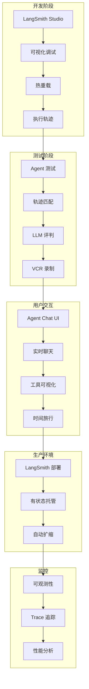

### 为什么需要 LangSmith？

| 痛点 | LangSmith 解决方案 |
|------|-------------------|
| Agent 执行是黑盒 | Studio 展示每一步细节 |
| 测试不稳定 | 提供轨迹匹配和 LLM 评判 |
| 缺少用户界面 | 开源 Chat UI |
| 部署复杂 | 专为 Agent 设计的托管平台 |
| 难以监控 | 自动 Trace 追踪 |

---


## 开发阶段：Studio

LangSmith Studio 是一个免费的可视化界面，用于在本地开发和测试 LangChain Agent。它连接到本地运行的 Agent，展示每一步的执行细节。

### 为什么需要 Studio

Agent 执行过程是个黑盒：

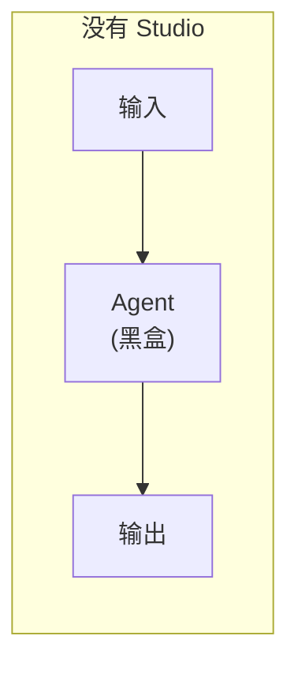

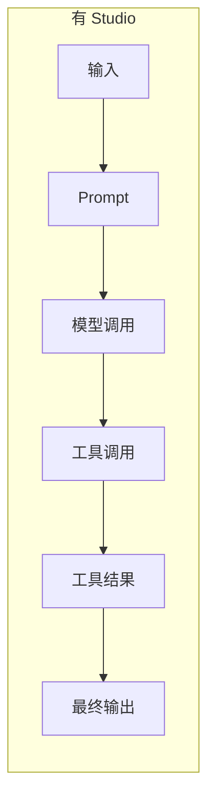

**Studio 能看到的信息**：

| 信息 | 说明 |
|------|------|
| Prompt | 发送给模型的完整提示词 |
| 工具调用 | 调用了哪些工具、参数是什么 |
| 工具结果 | 工具返回了什么 |
| 中间状态 | 每一步的状态变化 |
| Token 消耗 | 每次调用的 token 数量 |
| 延迟指标 | 每一步耗时多少 |
| 异常信息 | 哪一步出错、上下文是什么 |

### 前置条件

- Python >= 3.11
- LangSmith 账号（免费）：[smith.langchain.com](https://smith.langchain.com)
- LangSmith API Key

### 设置步骤

#### 1. 安装 LangGraph CLI

```bash
pip install --upgrade "langgraph-cli[inmem]"
```

#### 2. 准备 Agent 代码

```python
# src/agent.py
from langchain.agents import create_agent

def send_email(to: str, subject: str, body: str):
    """发送邮件"""
    email = {
        "to": to,
        "subject": subject,
        "body": body
    }
    # ... 邮件发送逻辑
    return f"邮件已发送给 {to}"

agent = create_agent(
    "gpt-4o",
    tools=[send_email],
    system_prompt="你是一个邮件助手。始终使用 send_email 工具。",
)
```

#### 3. 配置环境变量

创建 `.env` 文件：

```bash
# .env
LANGSMITH_API_KEY=lsv2_your_api_key_here

# 如果不想上传数据到 LangSmith，设置：
# LANGSMITH_TRACING=false
```

> **注意**：确保 `.env` 文件不要提交到 Git。

#### 4. 创建配置文件

创建 `langgraph.json`：

```json
{
  "dependencies": ["."],
  "graphs": {
    "agent": "./src/agent.py:agent"
  },
  "env": ".env"
}
```

| 字段 | 说明 |
|------|------|
| `dependencies` | 项目依赖路径 |
| `graphs` | Agent 入口，格式：`文件路径:变量名` |
| `env` | 环境变量文件路径 |

#### 5. 项目结构

```
my-app/
├── src/
│   └── agent.py        # Agent 代码
├── .env                # 环境变量（API Key）
└── langgraph.json      # LangGraph 配置
```

#### 6. 安装依赖

```bash
pip install langchain langchain-openai
# 或
uv add langchain langchain-openai
```

#### 7. 启动 Studio

```bash
langgraph dev
```

启动后：
- API 地址：`http://127.0.0.1:2024`
- Studio UI：`https://smith.langchain.com/studio/?baseUrl=http://127.0.0.1:2024`

> **Safari 用户**：Safari 会阻止 localhost 连接，使用 `langgraph dev --tunnel` 通过安全隧道访问。

### 工作流程

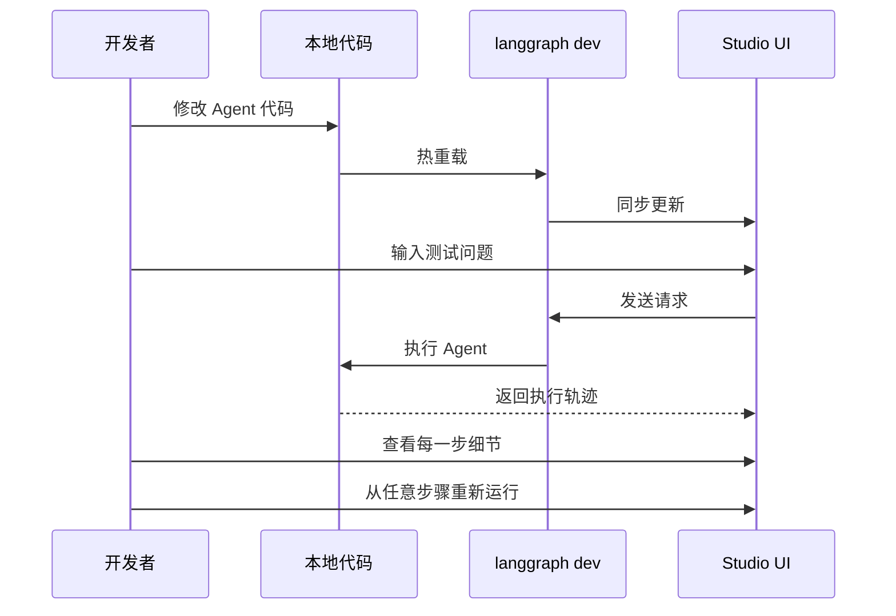

### 核心功能

#### 执行轨迹可视化

Studio 展示 Agent 执行的完整轨迹：

```
用户输入: "给张三发一封会议邀请邮件"
    │
    ├─ [1] 模型调用
    │      Prompt: "你是一个邮件助手..."
    │      Token: 150 | 延迟: 1.2s
    │
    ├─ [2] 工具调用: send_email
    │      参数: {to: "zhangsan@...", subject: "会议邀请", body: "..."}
    │
    ├─ [3] 工具结果
    │      返回: "邮件已发送给 zhangsan@..."
    │
    └─ [4] 最终输出
           "我已经给张三发送了会议邀请邮件。"
```

#### 热重载

修改代码后自动刷新，无需重启服务：

```python
# 修改 prompt
agent = create_agent(
    "gpt-4o",
    tools=[send_email],
    system_prompt="你是一个专业的邮件助手。请使用正式语气。",  # 改了这里
)
# 保存后 Studio 自动更新
```

#### 从任意步骤重新运行

发现问题后，可以从某一步重新执行，而不是从头开始：

```
[1] 模型调用 ✓
[2] 工具调用 ← 从这里重新运行
[3] ...
```

#### 异常调试

出错时，Studio 捕获：
- 异常类型和消息
- 出错时的状态
- 调用栈

### 隐私说明

| 设置 | 数据去向 |
|------|----------|
| `LANGSMITH_TRACING=true`（默认） | 执行轨迹上传到 LangSmith |
| `LANGSMITH_TRACING=false` | 数据仅在本地，不上传 |

---


## 测试阶段：Agent 测试

Agent 应用让 LLM 自主决定下一步行动，这种灵活性很强大，但模型的黑盒特性使得很难预测修改一个部分会如何影响整体。要构建生产级 Agent，全面测试是必不可少的。

### 测试类型

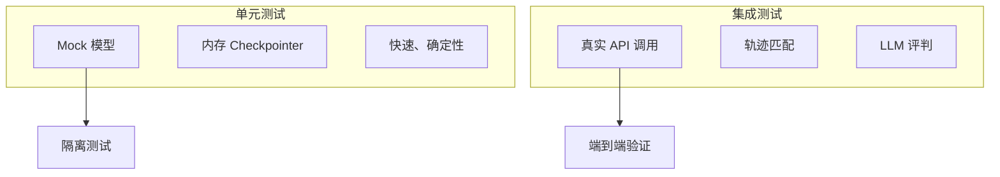

| 测试类型 | 特点 | 适用场景 |
|----------|------|----------|
| 单元测试 | 快速、确定性、使用 Mock | 测试小的、确定性的逻辑片段 |
| 集成测试 | 真实网络调用、验证组件协作 | 验证凭证、schema、延迟 |

> Agent 应用更依赖集成测试，因为它们链接多个组件，且 LLM 的非确定性会导致不稳定。

### 单元测试

#### Mock 聊天模型

对于不需要 API 调用的逻辑，使用内存 stub 模拟响应：

```python
from langchain_core.language_models.fake_chat_models import GenericFakeChatModel
from langchain_core.messages import AIMessage

# 创建 Mock 模型，返回预定义的响应序列
model = GenericFakeChatModel(
    messages=iter([
        AIMessage(
            content="", 
            tool_calls=[{
                "name": "foo", 
                "args": {"bar": "baz"}, 
                "id": "call_1"
            }]
        ),
        "bar"
    ])
)

# 第一次调用
result1 = model.invoke("hello")
# AIMessage(content='', tool_calls=[{'name': 'foo', 'args': {'bar': 'baz'}, ...}])

# 第二次调用，返回下一个响应
result2 = model.invoke("hello, again!")
# AIMessage(content='bar', ...)
```

#### InMemorySaver Checkpointer

使用内存 Checkpointer 测试状态依赖的行为：

```python
from langgraph.checkpoint.memory import InMemorySaver
from langchain.agents import create_agent
from langchain_core.messages import HumanMessage

agent = create_agent(
    model,
    tools=[],
    checkpointer=InMemorySaver()  # 内存持久化
)

# 第一次调用
agent.invoke(HumanMessage(content="我住在悉尼，澳大利亚。"))

# 第二次调用：第一条消息被持久化（悉尼位置），模型返回 GMT+10 时间
agent.invoke(HumanMessage(content="我的本地时间是多少？"))
```

### 集成测试

很多 Agent 行为只有在使用真实 LLM 时才会出现：
- Agent 决定调用哪个工具
- 如何格式化响应
- 修改 prompt 是否影响整个执行轨迹

#### 安装 AgentEvals

```bash
pip install agentevals
```

#### 轨迹匹配评估器

`agentevals` 提供 `create_trajectory_match_evaluator` 来匹配 Agent 轨迹：

| 模式 | 说明 | 使用场景 |
|------|------|----------|
| `strict` | 消息和工具调用完全匹配，顺序相同 | 测试特定序列（如先查策略再授权） |
| `unordered` | 相同工具调用，顺序可不同 | 验证信息检索，顺序不重要 |
| `subset` | Agent 只调用参考中的工具（不能多） | 确保 Agent 不超出预期范围 |
| `superset` | Agent 至少调用参考中的工具（可以多） | 验证最低要求的操作被执行 |

**Strict 模式示例：**

```python
from langchain.agents import create_agent
from langchain.tools import tool
from langchain.messages import HumanMessage, AIMessage, ToolMessage
from agentevals.trajectory.match import create_trajectory_match_evaluator

@tool
def get_weather(city: str):
    """获取城市天气信息"""
    return f"{city}：25度，晴天。"

agent = create_agent("gpt-4o", tools=[get_weather])

# 创建严格匹配评估器
evaluator = create_trajectory_match_evaluator(
    trajectory_match_mode="strict",
)

def test_weather_tool_called_strict():
    result = agent.invoke({
        "messages": [HumanMessage(content="旧金山天气怎么样？")]
    })
    
    # 参考轨迹
    reference_trajectory = [
        HumanMessage(content="旧金山天气怎么样？"),
        AIMessage(
            content="", 
            tool_calls=[{
                "id": "call_1", 
                "name": "get_weather", 
                "args": {"city": "旧金山"}
            }]
        ),
        ToolMessage(
            content="旧金山：25度，晴天。", 
            tool_call_id="call_1"
        ),
        AIMessage(content="旧金山现在25度，晴天。"),
    ]
    
    evaluation = evaluator(
        outputs=result["messages"],
        reference_outputs=reference_trajectory
    )
    
    # {'key': 'trajectory_strict_match', 'score': True, 'comment': None}
    assert evaluation["score"] is True
```

**Unordered 模式示例：**

```python
@tool
def get_weather(city: str):
    """获取天气"""
    return f"{city}：25度，晴天。"

@tool
def get_events(city: str):
    """获取活动"""
    return f"{city}今晚有公园音乐会。"

agent = create_agent("gpt-4o", tools=[get_weather, get_events])

evaluator = create_trajectory_match_evaluator(
    trajectory_match_mode="unordered",  # 顺序可不同
)

def test_multiple_tools_any_order():
    result = agent.invoke({
        "messages": [HumanMessage(content="旧金山今天有什么？")]
    })
    
    # 参考轨迹中工具顺序可能与实际不同
    reference_trajectory = [
        HumanMessage(content="旧金山今天有什么？"),
        AIMessage(content="", tool_calls=[
            {"id": "call_1", "name": "get_events", "args": {"city": "旧金山"}},
            {"id": "call_2", "name": "get_weather", "args": {"city": "旧金山"}},
        ]),
        ToolMessage(content="旧金山今晚有公园音乐会。", tool_call_id="call_1"),
        ToolMessage(content="旧金山：25度，晴天。", tool_call_id="call_2"),
        AIMessage(content="旧金山今天25度晴天，今晚有公园音乐会。"),
    ]
    
    evaluation = evaluator(
        outputs=result["messages"],
        reference_outputs=reference_trajectory,
    )
    
    assert evaluation["score"] is True
```

#### LLM-as-Judge 评估器

使用 LLM 来评估 Agent 的执行路径：

```python
from agentevals.trajectory.llm import (
    create_trajectory_llm_as_judge, 
    TRAJECTORY_ACCURACY_PROMPT
)

evaluator = create_trajectory_llm_as_judge(
    model="openai:o3-mini",
    prompt=TRAJECTORY_ACCURACY_PROMPT,
)

def test_trajectory_quality():
    result = agent.invoke({
        "messages": [HumanMessage(content="西雅图天气怎么样？")]
    })
    
    evaluation = evaluator(
        outputs=result["messages"],
    )
    
    # {
    #     'key': 'trajectory_accuracy',
    #     'score': True,
    #     'comment': 'Agent 轨迹合理...'
    # }
    assert evaluation["score"] is True
```

**带参考轨迹的 LLM 评判：**

```python
from agentevals.trajectory.llm import TRAJECTORY_ACCURACY_PROMPT_WITH_REFERENCE

evaluator = create_trajectory_llm_as_judge(
    model="openai:o3-mini",
    prompt=TRAJECTORY_ACCURACY_PROMPT_WITH_REFERENCE,
)

evaluation = evaluator(
    outputs=result["messages"],
    reference_outputs=reference_trajectory,  # 提供参考
)
```

#### 轨迹匹配 vs LLM 评判

| 方法 | 优点 | 缺点 |
|------|------|------|
| 轨迹匹配 | 确定性、快速、无额外 LLM 调用 | 需要硬编码参考轨迹 |
| LLM 评判 | 灵活、可评估细微差别 | 需要 LLM 调用、不确定性 |

### 录制和回放 HTTP 调用

集成测试调用真实 LLM API 可能很慢且昂贵。使用 `vcrpy` 录制 HTTP 请求/响应，后续运行时回放：

#### 安装

```bash
pip install vcrpy pytest-recording
```

#### 配置

```python
# conftest.py
import pytest

@pytest.fixture(scope="session")
def vcr_config():
    return {
        "filter_headers": [
            ("authorization", "XXXX"),
            ("x-api-key", "XXXX"),
        ],
        "filter_query_parameters": [
            ("api_key", "XXXX"),
            ("key", "XXXX"),
        ],
    }
```

```ini
# pytest.ini
[pytest]
markers =
    vcr: record/replay HTTP via VCR
addopts = --record-mode=once
```

#### 使用

```python
@pytest.mark.vcr()
def test_agent_trajectory():
    # 第一次运行：真实网络调用，生成 cassette 文件
    # 后续运行：使用 cassette 回放
    ...
```

> **注意**：修改 prompt、添加工具或更改预期轨迹后，需要删除 cassette 文件重新录制。

### 测试流程

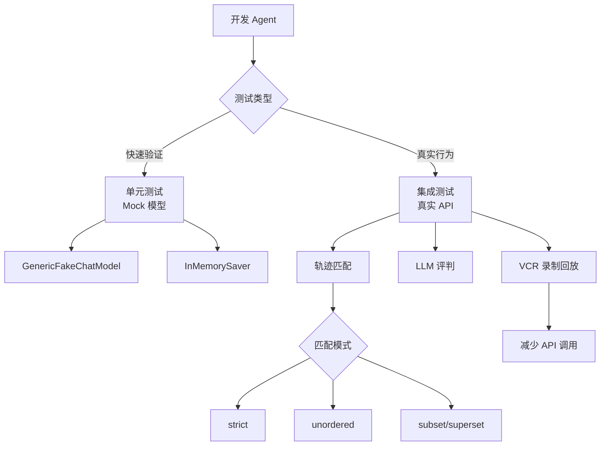

---


## 用户交互：Chat UI

Agent Chat UI 是一个 Next.js 应用，为任何 LangChain Agent 提供对话界面。它支持实时聊天、工具可视化，以及时间旅行调试和状态分叉等高级功能。

### 核心功能

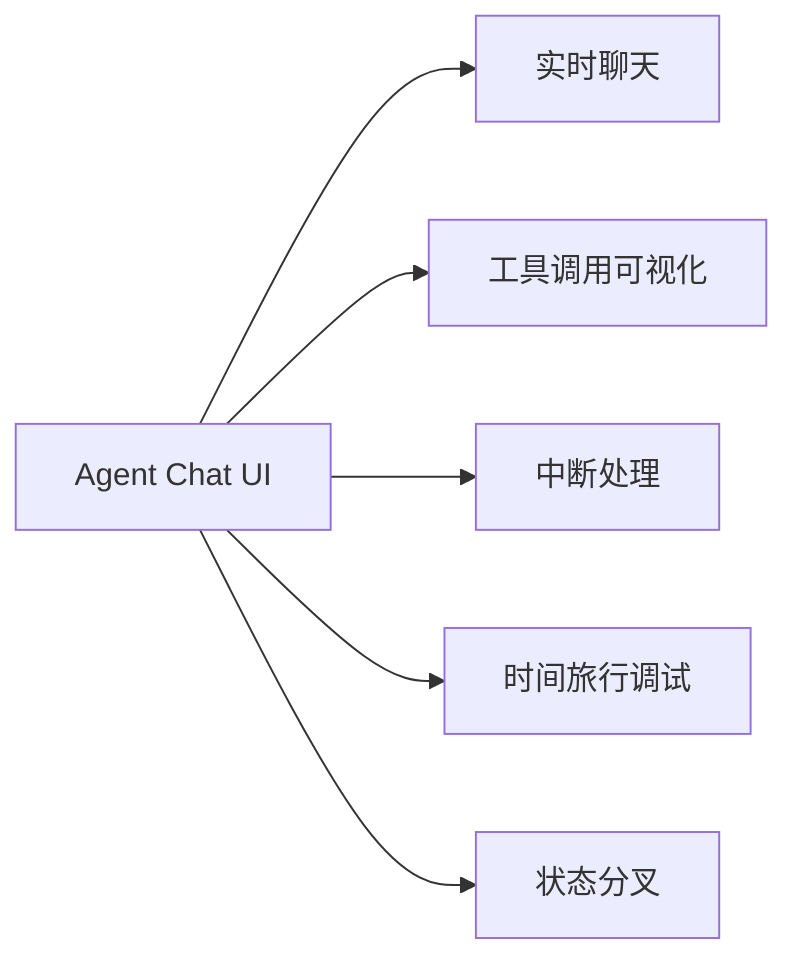

| 功能 | 说明 |
|------|------|
| 实时聊天 | 与 Agent 进行对话交互 |
| 工具可视化 | 自动渲染工具调用和结果 |
| 中断处理 | 显示和处理 Agent 中断（HITL） |
| 时间旅行 | 回到之前的状态重新执行 |
| 状态分叉 | 从某个状态创建分支探索不同路径 |

### 快速开始

#### 方式一：使用托管版本（最快）

1. 访问 [Agent Chat UI](https://agentchat.vercel.app)
2. 输入你的部署 URL 或本地服务器地址
3. 开始聊天

#### 方式二：本地运行

```bash
# 使用 npx 创建项目
npx create-agent-chat-app --project-name my-chat-ui
cd my-chat-ui

# 安装依赖并启动
pnpm install
pnpm dev
```

或者克隆仓库：

```bash
git clone https://github.com/langchain-ai/agent-chat-ui.git
cd agent-chat-ui

pnpm install
pnpm dev
```

### 连接 Agent

Agent Chat UI 可以连接本地和已部署的 Agent。

#### 配置项

| 配置 | 说明 | 示例 |
|------|------|------|
| Graph ID | 图名称（在 `langgraph.json` 的 `graphs` 中） | `agent` |
| Deployment URL | Agent 服务器地址 | `http://localhost:2024` |
| LangSmith API Key | 可选，本地服务器不需要 | `lsv2_...` |

#### 连接流程

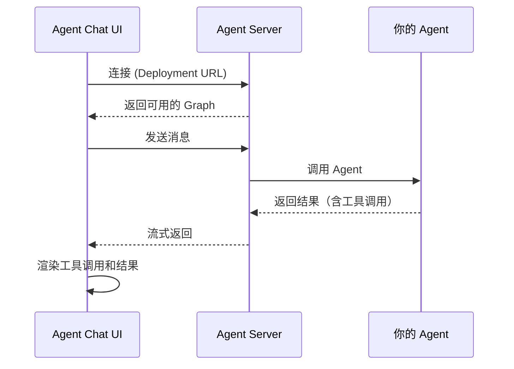

### 与 LangSmith Studio 的区别

| 特性 | Agent Chat UI | LangSmith Studio |
|------|---------------|------------------|
| 定位 | 用户交互界面 | 开发调试工具 |
| 主要用途 | 与 Agent 对话 | 查看执行轨迹、调试 |
| 部署 | 可独立部署给用户使用 | 开发时使用 |
| 自定义 | 开源，可完全自定义 | 固定界面 |
| 工具可视化 | ✅ | ✅ |
| 时间旅行 | ✅ | ✅ |

### 典型使用场景

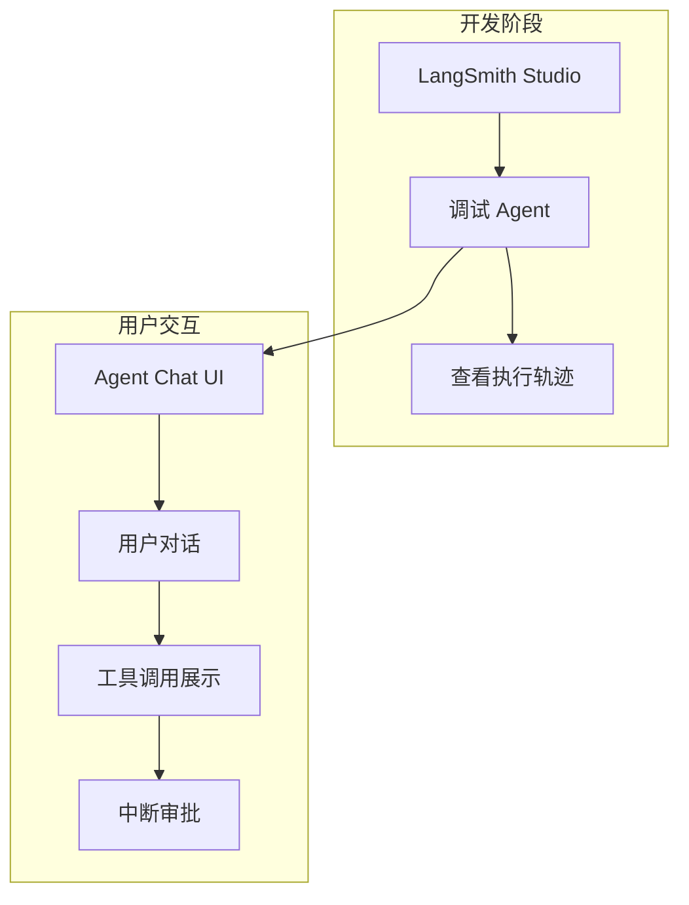

### 工具调用渲染

Agent Chat UI 自动渲染工具调用和结果：

```
用户: 查一下北京天气

Agent: [正在调用工具: get_weather]
       参数: {"city": "北京"}
       
       [工具结果]
       北京：25度，晴天
       
       北京现在25度，天气晴朗。
```

### 中断处理

当 Agent 配置了 HITL（人在回路）时，Chat UI 会显示中断并等待用户操作：

```
Agent: [需要审批]
       工具: delete_file
       参数: {"path": "/important/data.txt"}
       
       [批准] [拒绝] [编辑]
```

---


## 生产部署

当你准备将 LangChain Agent 部署到生产环境时，LangSmith 提供了专为 Agent 工作负载设计的托管平台。

### 为什么选择 LangSmith 部署

传统托管平台是为无状态、短生命周期的 Web 应用构建的，而 LangGraph 是**专为有状态、长时间运行的 Agent** 设计的，需要持久化状态和后台执行。

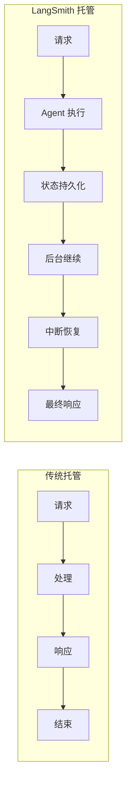

| 特性 | 传统托管 | LangSmith 托管 |
|------|----------|----------------|
| 状态管理 | 无状态 | 有状态持久化 |
| 执行时间 | 短（超时限制） | 长时间运行 |
| 中断恢复 | ❌ | ✅ |
| Agent 优化 | ❌ | ✅ |
| 自动扩缩 | 需配置 | 内置 |

### 前置条件

- GitHub 账号
- LangSmith 账号（免费注册）
- 代码已按 Studio 设置配置好

### 部署步骤

#### 1. 创建 GitHub 仓库

将你的应用代码推送到 GitHub 仓库（支持公开和私有仓库）。

项目结构：

```
my-agent/
├── src/
│   └── agent.py
├── .env              # 不要提交到 Git！
├── langgraph.json
└── requirements.txt
```

#### 2. 在 LangSmith 创建部署

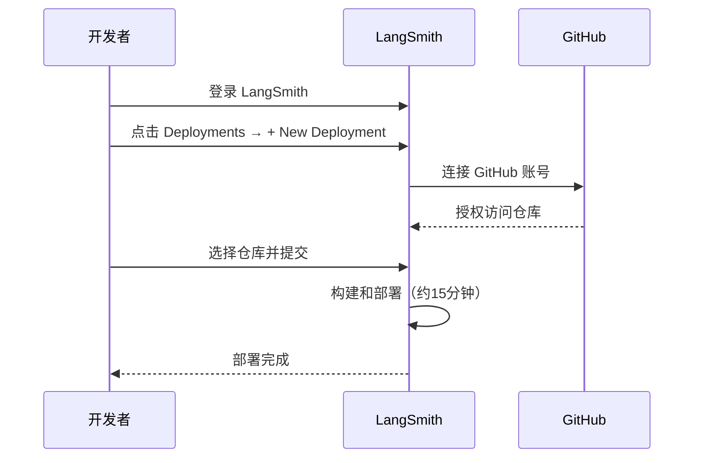

**步骤**：

1. 登录 [LangSmith](https://smith.langchain.com/)
2. 左侧边栏选择 **Deployments**
3. 点击 **+ New Deployment**
4. 首次使用需点击 **Add new account** 连接 GitHub
5. 选择你的仓库
6. 点击 **Submit** 开始部署

> 部署大约需要 15 分钟，可以在 **Deployment details** 查看状态。

#### 3. 在 Studio 中测试

部署完成后：

1. 选择刚创建的部署
2. 点击右上角 **Studio** 按钮
3. 在 Studio 中测试你的 Agent

#### 4. 获取 API URL

1. 在 **Deployment details** 页面
2. 点击 **API URL** 复制到剪贴板

### 调用已部署的 Agent

#### Python SDK

```bash
pip install langgraph-sdk
```

```python
from langgraph_sdk import get_sync_client  # 或 get_client 用于异步

client = get_sync_client(
    url="your-deployment-url",
    api_key="your-langsmith-api-key"
)

for chunk in client.runs.stream(
    None,       # Threadless run
    "agent",    # Agent 名称（在 langgraph.json 中定义）
    input={
        "messages": [
            {
                "role": "human",
                "content": "什么是 LangGraph？",
            }
        ],
    },
    stream_mode="updates",
):
    print(f"收到新事件: {chunk.event}...")
    print(chunk.data)
    print("\n")
```

#### REST API

```bash
curl -s --request POST \
  --url <DEPLOYMENT_URL>/runs/stream \
  --header 'Content-Type: application/json' \
  --header "X-Api-Key: <LANGSMITH_API_KEY>" \
  --data '{
    "assistant_id": "agent",
    "input": {
      "messages": [
        {
          "role": "human",
          "content": "什么是 LangGraph？"
        }
      ]
    },
    "stream_mode": "updates"
  }'
```

### 部署架构

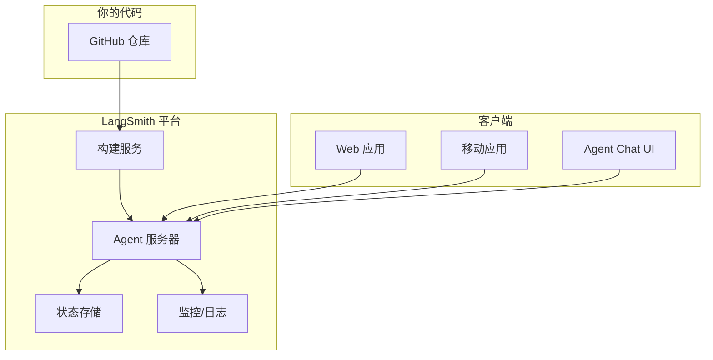

### 部署选项

| 选项 | 说明 |
|------|------|
| 托管版 | LangSmith 完全管理，最简单 |
| 自托管 | 在你自己的基础设施上运行 |
| 混合部署 | 部分托管，部分自托管 |

### 环境变量配置

在 LangSmith 部署设置中配置环境变量（不要在代码中硬编码）：

| 变量 | 说明 |
|------|------|
| `OPENAI_API_KEY` | OpenAI API 密钥 |
| `ANTHROPIC_API_KEY` | Anthropic API 密钥 |
| 其他自定义变量 | 数据库连接等 |

---


## 可观测性与监控

在构建和运行 Agent 时，你需要了解它们的行为：调用了哪些工具、生成了什么 prompt、如何做出决策。LangChain Agent 自动支持通过 LangSmith 进行追踪。

### 什么是 Trace

**Trace（追踪）** 记录 Agent 执行的每一步：从初始用户输入到最终响应，包括所有工具调用、模型交互和决策点。

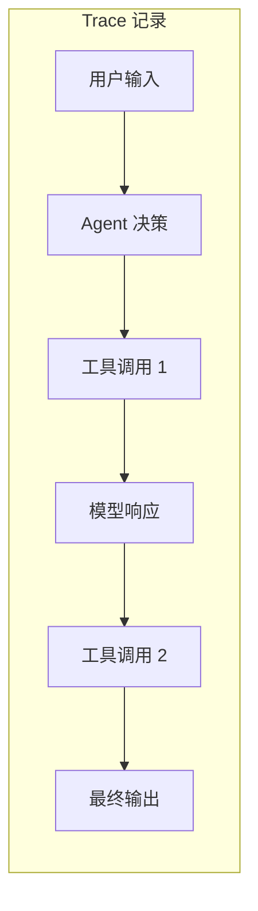

**Trace 的作用**：

| 用途 | 说明 |
|------|------|
| 调试 | 定位问题发生在哪一步 |
| 评估 | 比较不同输入的性能 |
| 监控 | 追踪生产环境的使用模式 |
| 优化 | 分析 token 消耗和延迟 |

### 前置条件

- LangSmith 账号（免费）：[smith.langchain.com](https://smith.langchain.com)
- LangSmith API Key

### 启用追踪

设置环境变量即可自动启用：

```bash
export LANGSMITH_TRACING=true
export LANGSMITH_API_KEY=<your-api-key>
```

或在 `.env` 文件中：

```bash
LANGSMITH_TRACING=true
LANGSMITH_API_KEY=lsv2_your_api_key_here
```

### 快速开始

无需额外代码，正常运行 Agent 即可自动记录 Trace：

```python
from langchain.agents import create_agent

def send_email(to: str, subject: str, body: str):
    """发送邮件"""
    return f"邮件已发送给 {to}"

def search_web(query: str):
    """搜索网页"""
    return f"搜索结果: {query}"

agent = create_agent(
    model="gpt-4o",
    tools=[send_email, search_web],
    system_prompt="你是一个有帮助的助手，可以发送邮件和搜索网页。"
)

# 运行 Agent - 所有步骤自动被追踪
response = agent.invoke({
    "messages": [{
        "role": "user", 
        "content": "搜索最新的 AI 新闻，然后发送摘要到 john@example.com"
    }]
})
```

### 选择性追踪

使用 `tracing_context` 控制哪些调用被追踪：

```python
import langsmith as ls

# 这个会被追踪
with ls.tracing_context(enabled=True):
    agent.invoke({
        "messages": [{"role": "user", "content": "发送测试邮件"}]
    })

# 这个不会被追踪（如果 LANGSMITH_TRACING 未设置）
agent.invoke({
    "messages": [{"role": "user", "content": "发送另一封邮件"}]
})
```

### 项目管理

#### 静态设置项目名

```bash
export LANGSMITH_PROJECT=my-agent-project
```

#### 动态设置项目名

```python
import langsmith as ls

with ls.tracing_context(project_name="email-agent-test", enabled=True):
    response = agent.invoke({
        "messages": [{"role": "user", "content": "发送欢迎邮件"}]
    })
```

### 添加元数据和标签

为 Trace 添加自定义元数据，便于筛选和分析：

```python
response = agent.invoke(
    {
        "messages": [{"role": "user", "content": "发送欢迎邮件"}]
    },
    config={
        "tags": ["production", "email-assistant", "v1.0"],
        "metadata": {
            "user_id": "user_123",
            "session_id": "session_456",
            "environment": "production"
        }
    }
)
```

或使用 `tracing_context`：

```python
with ls.tracing_context(
    project_name="email-agent-test",
    enabled=True,
    tags=["production", "email-assistant", "v1.0"],
    metadata={
        "user_id": "user_123", 
        "session_id": "session_456", 
        "environment": "production"
    }
):
    response = agent.invoke({
        "messages": [{"role": "user", "content": "发送欢迎邮件"}]
    })
```

### Trace 结构

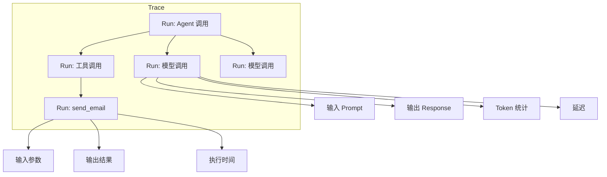

### 在 LangSmith 中查看

1. 登录 [LangSmith](https://smith.langchain.com/)
2. 选择项目（默认是 `default`）
3. 查看 Trace 列表
4. 点击单个 Trace 查看详情

**可以看到的信息**：

| 信息 | 说明 |
|------|------|
| 输入/输出 | 每一步的输入和输出 |
| Token 统计 | 每次模型调用的 token 数 |
| 延迟 | 每一步的执行时间 |
| 错误 | 如果有异常，显示错误信息 |
| 元数据 | 自定义的 tags 和 metadata |

### 配置汇总

| 环境变量 | 说明 | 默认值 |
|----------|------|--------|
| `LANGSMITH_TRACING` | 是否启用追踪 | `false` |
| `LANGSMITH_API_KEY` | API 密钥 | 无 |
| `LANGSMITH_PROJECT` | 项目名称 | `default` |
| `LANGSMITH_ENDPOINT` | API 端点 | `https://api.smith.langchain.com` |

---


## 完整开发流程

LangSmith 工具链覆盖了从开发到生产的完整生命周期：

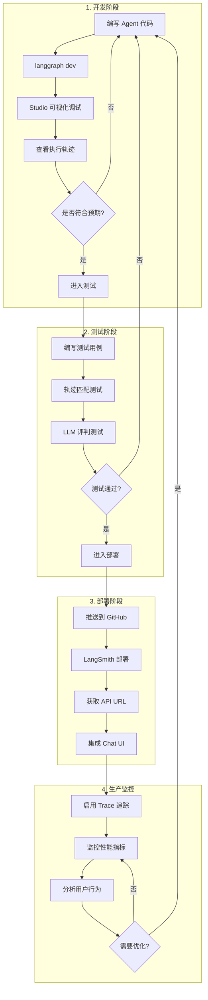

### 开发流程详解

#### 阶段 1：本地开发

```bash
# 1. 创建项目结构
mkdir my-agent && cd my-agent
mkdir src

# 2. 编写 Agent 代码
# src/agent.py

# 3. 配置环境
# .env 和 langgraph.json

# 4. 启动开发服务器
langgraph dev

# 5. 在 Studio 中测试
# 访问 https://smith.langchain.com/studio/?baseUrl=http://127.0.0.1:2024
```

**关键工具**：
- `langgraph dev`：本地开发服务器
- Studio：可视化调试界面
- 热重载：代码修改自动生效

#### 阶段 2：编写测试

```python
# tests/test_agent.py
import pytest
from agentevals.trajectory.match import create_trajectory_match_evaluator
from src.agent import agent

@pytest.mark.vcr()
def test_agent_calls_correct_tools():
    evaluator = create_trajectory_match_evaluator(
        trajectory_match_mode="strict"
    )
    
    result = agent.invoke({
        "messages": [{"role": "user", "content": "发送测试邮件"}]
    })
    
    reference_trajectory = [...]  # 预期轨迹
    
    evaluation = evaluator(
        outputs=result["messages"],
        reference_outputs=reference_trajectory
    )
    
    assert evaluation["score"] is True
```

**关键工具**：
- `agentevals`：轨迹匹配和 LLM 评判
- `vcrpy`：录制和回放 HTTP 调用
- `pytest`：测试框架

#### 阶段 3：部署到生产

```bash
# 1. 推送代码到 GitHub
git add .
git commit -m "Ready for deployment"
git push origin main

# 2. 在 LangSmith 创建部署
# 访问 https://smith.langchain.com/deployments
# 点击 + New Deployment
# 选择 GitHub 仓库

# 3. 等待部署完成（约15分钟）

# 4. 获取 API URL 并测试
```

**关键工具**：
- GitHub：代码托管
- LangSmith Deployments：托管平台
- `langgraph-sdk`：调用已部署的 Agent

#### 阶段 4：生产监控

```python
# 启用追踪
import os
os.environ["LANGSMITH_TRACING"] = "true"
os.environ["LANGSMITH_API_KEY"] = "lsv2_..."

# 添加元数据
response = agent.invoke(
    {"messages": [...]},
    config={
        "tags": ["production", "v1.0"],
        "metadata": {
            "user_id": "user_123",
            "environment": "production"
        }
    }
)
```

**关键工具**：
- LangSmith Trace：自动追踪
- 元数据和标签：分类和筛选
- 性能分析：Token 消耗和延迟

### 最佳实践

| 阶段 | 最佳实践 |
|------|----------|
| 开发 | 使用 Studio 实时查看每一步执行细节 |
| 测试 | 结合轨迹匹配和 LLM 评判，使用 VCR 减少 API 调用 |
| 部署 | 使用环境变量管理敏感信息，不要硬编码 |
| 监控 | 添加有意义的 tags 和 metadata，便于筛选和分析 |

### 工具链对比

| 工具 | 用途 | 使用时机 |
|------|------|----------|
| Studio | 可视化调试 | 开发阶段 |
| AgentEvals | 测试验证 | 测试阶段 |
| Chat UI | 用户交互 | 开发和生产 |
| Deployments | 托管运行 | 生产阶段 |
| Trace | 追踪监控 | 全流程 |

---


## 总结

LangSmith 工具链提供了从开发到生产的完整解决方案：

| 组件 | 核心功能 | 关键价值 |
|------|----------|----------|
| **Studio** | 可视化调试、热重载、执行轨迹 | 让 Agent 执行过程透明化 |
| **Agent 测试** | 轨迹匹配、LLM 评判、VCR 录制 | 确保 Agent 行为符合预期 |
| **Chat UI** | 实时聊天、工具可视化、时间旅行 | 提供用户交互界面 |
| **部署** | 有状态托管、自动扩缩、GitHub 集成 | 简化生产部署 |
| **可观测性** | Trace 追踪、性能分析、元数据管理 | 监控和优化生产环境 |

### 快速开始检查清单

- [ ] 注册 LangSmith 账号并获取 API Key
- [ ] 安装 `langgraph-cli[inmem]`
- [ ] 创建 `langgraph.json` 配置文件
- [ ] 配置 `.env` 环境变量
- [ ] 运行 `langgraph dev` 启动开发服务器
- [ ] 在 Studio 中测试 Agent
- [ ] 编写测试用例（轨迹匹配或 LLM 评判）
- [ ] 推送代码到 GitHub
- [ ] 在 LangSmith 创建部署
- [ ] 启用 Trace 追踪监控生产环境

### 相关资源

- [LangSmith 官方文档](https://docs.smith.langchain.com/)
- [LangGraph 文档](https://langchain-ai.github.io/langgraph/)
- [Agent Chat UI GitHub](https://github.com/langchain-ai/agent-chat-ui)
- [AgentEvals GitHub](https://github.com/langchain-ai/agentevals)

---

