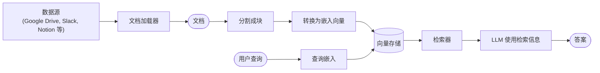
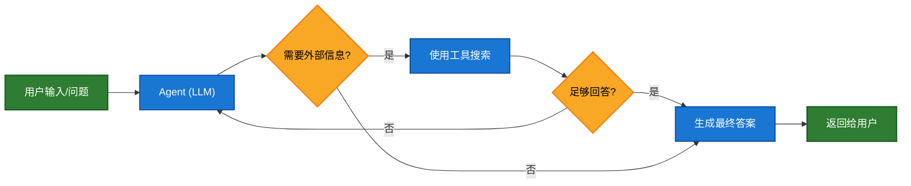
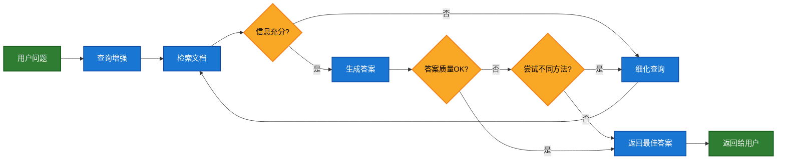
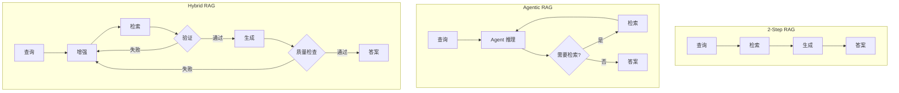

# RAG 检索详解

大语言模型（LLM）很强大，但有两个关键限制：

- **有限上下文**：无法一次性摄入整个语料库
- **静态知识**：训练数据冻结在某个时间点

检索通过在查询时获取相关外部知识来解决这些问题。这是 **检索增强生成（RAG）** 的基础：用特定上下文信息增强 LLM 的回答。

## 知识库构建

**知识库** 是在检索过程中使用的文档或结构化数据仓库。

> **注意**：如果你已有知识库（如 SQL 数据库、CRM 或内部文档系统），**不需要** 重建它。你可以：
> - 将其作为 **工具** 连接给 Agent（Agentic RAG）
> - 查询它并将检索内容作为上下文提供给 LLM（2-Step RAG）

### 检索流程



每个组件都是模块化的：你可以替换加载器、分割器、嵌入模型或向量存储，而无需重写应用逻辑。

### 构建模块

| 模块 | 说明 |
|------|------|
| 文档加载器 | 从外部源（Google Drive、Slack、Notion 等）摄入数据，返回标准化的 `Document` 对象 |
| 文本分割器 | 将大文档分割成更小的块，便于单独检索且适合模型上下文窗口 |
| 嵌入模型 | 将文本转换为向量，使语义相似的文本在向量空间中距离更近 |
| 向量存储 | 专门用于存储和搜索嵌入向量的数据库 |
| 检索器 | 给定非结构化查询返回文档的接口 |

## RAG 架构对比

| 架构 | 描述 | 控制性 | 灵活性 | 延迟 | 示例场景 |
|------|------|--------|--------|------|----------|
| **2-Step RAG** | 检索总是在生成之前发生，简单可预测 | ✅ 高 | ❌ 低 | ⚡ 快 | FAQ、文档机器人 |
| **Agentic RAG** | LLM Agent 决定何时、如何在推理过程中检索 | ❌ 低 | ✅ 高 | ⏳ 可变 | 多工具研究助手 |
| **Hybrid RAG** | 结合两种方法的特点，带验证步骤 | ⚖️ 中 | ⚖️ 中 | ⏳ 可变 | 带质量验证的领域问答 |

> **延迟说明**：2-Step RAG 的延迟通常更**可预测**，因为 LLM 调用次数已知且有上限。但实际延迟还受检索步骤性能影响（API 响应时间、网络延迟、数据库查询等）。

## 2-Step RAG

在 **2-Step RAG** 中，检索步骤总是在生成步骤之前执行。这种架构简单可预测，适合检索相关文档是生成答案明确前提的场景。


### 特点

- **固定流程**：检索 → 生成，顺序不变
- **可预测延迟**：最多两次主要操作
- **简单实现**：无需复杂的决策逻辑

## Agentic RAG

**Agentic RAG** 结合了检索增强生成与基于 Agent 的推理。Agent（由 LLM 驱动）逐步推理并决定**何时**、**如何**在交互过程中检索信息，而不是在回答前就检索文档。

> **关键点**：Agent 只需要访问一个或多个能获取外部知识的**工具**（如文档加载器、Web API 或数据库查询）即可实现 RAG 行为。



### 基本实现

```python
import requests
from langchain.tools import tool
from langchain.chat_models import init_chat_model
from langchain.agents import create_agent

@tool
def fetch_url(url: str) -> str:
    """从 URL 获取文本内容"""
    response = requests.get(url, timeout=10.0)
    response.raise_for_status()
    return response.text

system_prompt = """\
当你需要从网页获取信息时使用 fetch_url；引用相关片段。
"""

agent = create_agent(
    model="claude-sonnet-4-5-20250929",
    tools=[fetch_url],  # 检索工具
    system_prompt=system_prompt,
)
```

### 完整示例：基于 llms.txt 的 Agentic RAG

```python
import requests
from langchain.agents import create_agent
from langchain.messages import HumanMessage
from langchain.tools import tool
from markdownify import markdownify

ALLOWED_DOMAINS = ["https://langchain-ai.github.io/"]
LLMS_TXT = 'https://langchain-ai.github.io/langgraph/llms.txt'

@tool
def fetch_documentation(url: str) -> str:
    """获取并转换文档 URL 的内容"""
    if not any(url.startswith(domain) for domain in ALLOWED_DOMAINS):
        return (
            "错误：URL 不允许。"
            f"必须以以下之一开头：{', '.join(ALLOWED_DOMAINS)}"
        )
    response = requests.get(url, timeout=10.0)
    response.raise_for_status()
    return markdownify(response.text)

# 预先获取 llms.txt 内容（无需 LLM 请求）
llms_txt_content = requests.get(LLMS_TXT).text

system_prompt = f"""你是一位 Python 专家和技术助手。
你的主要职责是帮助用户解答关于 LangGraph 和相关工具的问题。

指令：
1. 如果用户问的问题你不确定——或可能涉及 API 使用、行为或配置——
   你必须使用 `fetch_documentation` 工具查阅相关文档。
2. 引用文档时，清晰总结并包含内容的相关上下文。
3. 不要使用允许域之外的任何 URL。
4. 如果文档获取失败，告知用户并根据你的专业理解继续。

你可以从以下批准的来源访问官方文档：
{llms_txt_content}

在回答用户关于 LangGraph 的问题之前，你必须查阅文档以获取最新信息。
你的回答应该清晰、简洁、技术准确。"""

agent = create_agent(
    model=init_chat_model("claude-sonnet-4-0", max_tokens=32_000),
    tools=[fetch_documentation],
    system_prompt=system_prompt,
    name="Agentic RAG",
)

response = agent.invoke({
    'messages': [HumanMessage(content=(
        "写一个使用 prebuilt create react agent 的 "
        "langgraph agent 简短示例。该 agent 应该能够"
        "查询股票价格信息。"
    ))]
})
print(response['messages'][-1].content)
```

## Hybrid RAG

Hybrid RAG 结合了 2-Step 和 Agentic RAG 的特点。它引入中间步骤如查询预处理、检索验证和生成后检查。这些系统比固定流程更灵活，同时保持对执行的一定控制。

### 典型组件

| 组件 | 说明 |
|------|------|
| 查询增强 | 修改输入问题以提高检索质量（重写不清晰的查询、生成多个变体、扩展查询上下文） |
| 检索验证 | 评估检索的文档是否相关且充分，如果不够可能细化查询并重新检索 |
| 答案验证 | 检查生成答案的准确性、完整性和与源内容的一致性，必要时重新生成或修订 |



### 适用场景

- 查询模糊或不明确的应用
- 需要验证或质量控制步骤的系统
- 涉及多个来源或迭代细化的工作流

## 三种架构对比



## 总结

| 概念 | 说明 |
|------|------|
| RAG | 检索增强生成，用外部知识增强 LLM 回答 |
| 知识库 | 检索过程中使用的文档或结构化数据仓库 |
| 嵌入向量 | 文本的向量表示，语义相似的文本距离更近 |
| 2-Step RAG | 固定流程：检索 → 生成，简单可预测 |
| Agentic RAG | Agent 决定何时检索，灵活但延迟可变 |
| Hybrid RAG | 结合两者，带查询增强和验证步骤 |
| 渐进式披露 | 按需加载知识，而非预先加载所有 |
