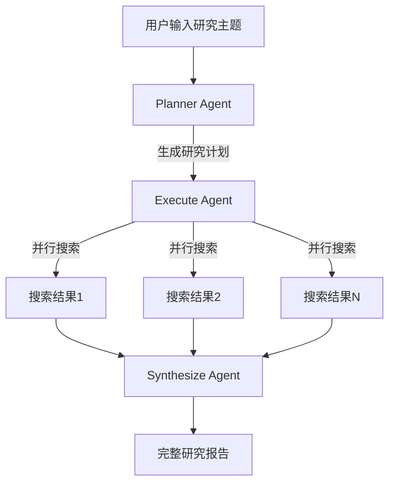

# Deep Research 实践

Deep Research 是一种多 Agent 协作架构，用于构建研究型助手。它能够接收研究主题，自动规划搜索策略，执行信息检索，最终生成完整的研究报告。

## 背景

大型语言模型具备强大的生成与推理能力，但知识受限于训练数据，对时效性强或专业领域的新信息掌握不足。传统 RAG 方案让模型检索外部文档来扩充知识，但主要是被动享用检索结果，缺少主动探索和深度推理的能力。

Deep Research 是一种新范式，让智能体可以进行网页检索阅读，一步步获取所需信息，最终输出最优答案。它不只是收集信息，更得把证据系统整合、结构化表达出来，生成**长篇分析报告**。

## 核心架构

Deep Research 将复杂的研究任务分解为三个阶段：



| 阶段 | Agent | 职责 | 模型选择 |
|------|-------|------|----------|
| 规划 | Planner Agent | 分解主题，生成研究关键词和搜索策略 | 强模型（需要推理能力） |
| 执行 | Execute Agent | 执行网络搜索，总结单个信息源 | 便宜模型（任务简单） |
| 合成 | Synthesize Agent | 汇总所有结果，编写完整报告 | 强模型（需要长文本生成） |

## 为什么分三个阶段？

这种设计遵循 OpenAI 的 Deep Research 架构思想：**不要试图用一个巨长的提示词让模型一次性完成所有研究**。

| 单一 Agent | 多阶段 Agent |
|------------|--------------|
| 上下文窗口容易爆满 | 每个阶段独立上下文 |
| 难以并行处理 | Execute 阶段可并行 |
| 成本高（全程用强模型） | 成本优化（按需选模型） |
| 失败难以定位 | 每阶段可独立调试 |

## 阶段详解

### 1. Planner Agent（规划阶段）

**目标**：将用户的研究主题分解为具体的、可独立研究的子问题。

**输入**：用户的研究主题（如"AI 对教育的影响"）

**输出**：结构化的研究计划

```python
from pydantic import BaseModel, Field
from typing import List

class ResearchPlan(BaseModel):
    """研究计划的结构化输出"""
    topic: str = Field(description="研究主题")
    sub_questions: List[str] = Field(description="分解的子问题列表")
    search_keywords: List[str] = Field(description="搜索关键词列表")
    search_strategy: str = Field(description="搜索策略说明")
```

**示例输出**：
```json
{
  "topic": "AI 对教育的影响",
  "sub_questions": [
    "AI 在个性化学习中的应用现状",
    "AI 辅助教学的效果研究",
    "AI 对教师角色的影响",
    "AI 教育工具的伦理问题"
  ],
  "search_keywords": [
    "AI personalized learning",
    "AI tutoring effectiveness",
    "AI teacher role transformation",
    "AI education ethics"
  ],
  "search_strategy": "先搜索综述性文章了解全貌，再针对每个子问题深入搜索"
}
```

### 2. Execute Agent（执行阶段）

**目标**：针对每个关键词执行搜索，并对单个信息源进行初步总结。

**特点**：
- 可并行处理多个搜索任务
- 使用便宜模型（任务相对简单）
- 每个搜索结果独立总结，避免上下文污染

**工具**：
- 网络搜索工具（如 Tavily、SerpAPI）
- 网页内容提取工具

```python
from langchain.tools import tool

@tool
def web_search(query: str) -> str:
    """执行网络搜索，返回搜索结果摘要"""
    # 调用搜索 API
    results = search_api.search(query)
    return format_results(results)

@tool
def extract_content(url: str) -> str:
    """提取网页内容"""
    content = fetch_and_parse(url)
    return content
```

**输出**：每个关键词的搜索摘要

```python
class SearchResult(BaseModel):
    """单个搜索结果的结构化输出"""
    keyword: str = Field(description="搜索关键词")
    sources: List[str] = Field(description="信息来源 URL")
    summary: str = Field(description="内容摘要")
    key_findings: List[str] = Field(description="关键发现")
```

### 3. Synthesize Agent（合成阶段）

**目标**：将所有搜索结果汇总，生成连贯、完整的研究报告。

**输入**：所有 Execute Agent 的输出结果

**输出**：结构化的研究报告

```python
class ResearchReport(BaseModel):
    """最终研究报告的结构化输出"""
    title: str = Field(description="报告标题")
    executive_summary: str = Field(description="执行摘要")
    sections: List[ReportSection] = Field(description="报告章节")
    conclusions: List[str] = Field(description="主要结论")
    references: List[str] = Field(description="参考来源")

class ReportSection(BaseModel):
    """报告章节"""
    heading: str = Field(description="章节标题")
    content: str = Field(description="章节内容")
```

## 模型选择策略

| 阶段 | 推荐模型 | 原因 |
|------|----------|------|
| Planner | qwen-max / gpt-4o | 需要强推理能力分解问题 |
| Execute | qwen-plus / gpt-4o-mini | 任务简单，成本敏感 |
| Synthesize | qwen-max / gpt-4o | 需要长文本生成和逻辑组织 |

这种策略可以在保证质量的同时，显著降低 API 调用成本。

## 与 Sub-Agent 模式的关系

Deep Research 本质上是 Sub-Agent 模式的进阶应用：

| 对比 | 基础 Sub-Agent | Deep Research |
|------|----------------|---------------|
| 结构 | 主 Agent + 子 Agent | 三阶段流水线 |
| 控制流 | 主 Agent 动态决策 | 固定流程：Plan → Execute → Synthesize |
| 并行 | 可选 | Execute 阶段必须并行 |
| 输出 | 简单结果 | 长篇结构化报告 |

## 实现要点

### 1. 上下文隔离

每个阶段使用独立的上下文，避免信息过载：

```python
# Planner 只看到用户输入
planner_result = planner_agent.invoke({
    "messages": [{"role": "user", "content": topic}]
})

# Execute 只看到单个关键词
for keyword in planner_result.search_keywords:
    execute_result = execute_agent.invoke({
        "messages": [{"role": "user", "content": f"搜索并总结：{keyword}"}]
    })

# Synthesize 只看到汇总的搜索结果
synthesize_input = format_all_results(all_results)
final_report = synthesize_agent.invoke({
    "messages": [{"role": "user", "content": synthesize_input}]
})
```

### 2. 并行执行

Execute 阶段应并行处理多个搜索任务：

```python
import asyncio

async def execute_searches(keywords: List[str]):
    tasks = [
        execute_agent.ainvoke({
            "messages": [{"role": "user", "content": f"搜索：{kw}"}]
        })
        for kw in keywords
    ]
    results = await asyncio.gather(*tasks)
    return results
```

### 3. 错误处理

每个阶段应有独立的错误处理：

```python
def safe_execute(keyword: str) -> SearchResult:
    try:
        result = execute_agent.invoke(...)
        return result
    except Exception as e:
        return SearchResult(
            keyword=keyword,
            sources=[],
            summary=f"搜索失败：{str(e)}",
            key_findings=[]
        )
```

## 扩展方向

| 扩展 | 说明 |
|------|------|
| 迭代深化 | Synthesize 发现信息不足时，触发新一轮 Execute |
| 人工介入 | 在 Plan 阶段后让用户确认/修改研究计划 |
| 多模态 | Execute 阶段支持图片、PDF 等内容提取 |
| 缓存 | 缓存搜索结果，避免重复查询 |
| 评估 | 添加 Reviewer Agent 评估报告质量 |

## 总结

| 概念 | 说明 |
|------|------|
| Deep Research | 多 Agent 协作的研究型架构 |
| 三阶段流程 | Plan（规划）→ Execute（执行）→ Synthesize（合成） |
| 模型优化 | 不同阶段使用不同能力/成本的模型 |
| 并行执行 | Execute 阶段并行处理多个搜索任务 |
| 上下文隔离 | 每个阶段独立上下文，避免信息过载 |
| 结构化输出 | 使用 Pydantic 定义每个阶段的输入输出格式 |
